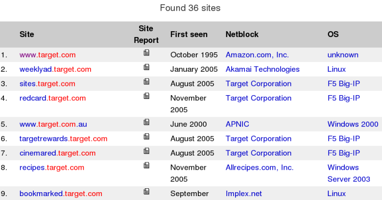

[Download](https://nmap.org/download.html)[Reference Guide](https://nmap.org/book/man.html)[Book](https://nmap.org/book/)[Docs](https://nmap.org/docs.html)[Zenmap GUI](https://nmap.org/zenmap/)[In the Movies](https://nmap.org/movies/)

* [Nmap Network Scanning](https://nmap.org/book/toc.html)
* [Chapter 3. Host Discovery (“Ping Scanning”)](https://nmap.org/book/host-discovery.html)
* Finding an Organization's IP Addresses

[Prev](https://nmap.org/book/host-discovery-specify-targets.html)

[Next](https://nmap.org/book/host-discovery-dns.html)

Finding an Organization's IP Addresses
----------

[]()

Nmap automates many aspects of network scanning, but you still
must tell it which networks to scan. I suppose you could specify`-iR` and hope Nmap hits your target company randomly,
or you could try the brute force method of specifying `0.0.0.0/0` to scan the whole
Internet. But either of those options could take months or years, and
possibly get you into trouble. So it is important to carefully
research target netblocks before scanning them. Even if you are
conducting a legitimate
penetration test[]()and the client gave you a
list of their netblocks, it is important to double check them. Clients sometimes have out-of-date records or simply write them down wrong.
An authorization letter signed by your client won't help if you
accidentally break into the wrong company.

In many cases, you start with only a company's domain name.
This section demonstrates a few of the most common and effective ways
to turn that into a list of netblocks owned, operated by, or
affiliated with the target company. Typical Linux command-line
utilities are demonstrated, but similar tools are available for other
platforms.

At the ShmooCon conference in 2006, a fellow came up to me and
complained that Nmap documentation specified many example ways to
scan`target.com`.[]()He noted that ICANN had reserved the domain name`example.com`[]()for this
purpose, and pressured me to revise the man page accordingly. While
he was technically right, it was a strange thing to obsess about. His
motivation became clear when he handed me his business card:

Figure 3.1. A business card explains everything


Apparently, many Nmap users copied examples straight from the
man page and ran them without changing the target specifier. So
target.com was flooded with scans and corresponding IDS alerts. In
honor of that incident, the goal of this section is to determine IP
ranges assigned to and used by
Target Corporation.[]()

### DNS Tricks ###

[]()

The primary purpose of DNS is to resolve domain names into IP addresses, so it is a logical place to start. In [Example 3.1](https://nmap.org/book/host-discovery-find-ips.html#host-discovery-ex-target-host), I use the Linux**host** command[]()to query some common DNS record types.

Example 3.1. Using the host command to query common DNS record types

```
> host -t ns target.com
target.com name server ns4.target.com.
target.com name server ns3.target.com.
target.com name server ns1-auth.sprintlink.net.
target.com name server ns2-auth.sprintlink.net.
target.com name server ns3-auth.sprintlink.net.
> host -t a target.com
target.com has address 161.225.130.163
target.com has address 161.225.136.0
> host -t aaaa target.com
target.com has no AAAA record
> host -t mx target.com
target.com mail is handled by 50 smtp02.target.com.
target.com mail is handled by 5 smtp01.target.com.
> host -t soa target.com
target.com has SOA record extdns02.target.com. hostmaster.target.com.

```

Next I resolve the IP addresses for the hostnames above (using
host again) and I try a few common subdomain names such
as `www.target.com` and`ftp.target.com`.[]()Starting with names like `ns3.target.com` and `smtp01.target.com`, I try changing the digits to find new machines.
All of this leaves me with the following target.com names and
addresses:

Table 3.1. First pass at listing target.com IPs

|     Hostname      |         IP Addresses         |
|-------------------|------------------------------|
|  ns3.target.com   |       161.225.130.130        |
|  ns4.target.com   |       161.225.136.136        |
|  ns5.target.com   |       161.225.130.150        |
|    target.com     |161.225.136.0, 161.225.130.163|
| smtp01.target.com |       161.225.140.120        |
| smtp02.target.com | 198.70.53.234, 198.70.53.235 |
|extdns02.target.com|         172.17.14.69         |
|  www.target.com   |        207.171.166.49        |

While a substantial hostname list can be generated in this
manner, the mother lode of hostnames comes from a
zone transfer.[]()[]()Most DNS servers now reject zone transfer requests, but it is worth
a try because many still allow it. Be sure to try every DNS server you
have found through domain NS records and port scanning corporate IP ranges.
So far we have found seven Target nameservers: `ns3.target.com`,`ns4.target.com`, `ns5.target.com`, `ns1-auth.sprintlink.net`,`ns2-auth.sprintlink.net`, `ns3-auth.sprintlink.net`, and`extdns02.target.com`. Unfortunately, all of those servers either
refused the transfer or did not support the TCP DNS connections
required for a zone
transfer. [Example 3.2](https://nmap.org/book/host-discovery-find-ips.html#host-discovery-ex-zone-xfer) shows a failed`target.com` zone transfer attempt using the common **dig** (domain
information groper) tool[<sup class="footnote" id="idm45818756288928">[9]</sup>](https://nmap.org/book/host-discovery-find-ips.html#ftn.idm45818756288928), followed by a successful one against an
unrelated organization (`cpsr.org`).

Example 3.2. Zone transfer failure and success

```
> dig @ns2-auth.sprintlink.net -t AXFR target.com
; <<>> DiG 9.5.0b3 <<>> @ns2-auth.sprintlink.net -t AXFR target.com

; Transfer failed.

> dig @ns2.eppi.com -t AXFR cpsr.org
; <<>> DiG 9.5.0b1 <<>> @ns2.eppi.com -t AXFR cpsr.org

cpsr.org             10800   IN      SOA   ns1.findpage.com. root.cpsr.org.
cpsr.org.            10800   IN      NS    ns.stimpy.net.
cpsr.org.            10800   IN      NS    ns1.findpage.com.
cpsr.org.            10800   IN      NS    ns2.eppi.com.
cpsr.org.            10800   IN      A     208.96.55.202
cpsr.org.            10800   IN      MX    0 smtp.electricembers.net.
diac.cpsr.org.       10800   IN      A     64.147.163.10
groups.cpsr.org.     10800   IN      NS    ns1.electricembers.net.
localhost.cpsr.org.  10800   IN      A     127.0.0.1
mail.cpsr.org.       10800   IN      A     209.209.81.73
peru.cpsr.org.       10800   IN      A     208.96.55.202
www.peru.cpsr.org.   10800   IN      A     208.96.55.202
[...]

```

A common mistake when gathering forward DNS results like these
is assuming that all systems found under a domain name must be part of
that organization's network and safe to scan. In fact, nothing
prevents an organization from adding records pointing anywhere on the
Internet. This is commonly done to outsource services to third
parties while keeping the source domain name for branding. For
example, `www.target.com` resolves to `207.171.166.49`. Is this part of
Target's network, or is it managed by a third party we might not want
to scan? Three quick and easy tests are
DNS reverse-resolution,[]()traceroute, and whois against the relevant IP address registry. The
first two steps can be done by Nmap, while the Linux whois command
works well for the third. These tests
against `target.com` are shown in[Example 3.3](https://nmap.org/book/host-discovery-find-ips.html#host-discovery-ex-www-target-nmap) and[Example 3.4](https://nmap.org/book/host-discovery-find-ips.html#host-discovery-ex-www-target-whois).

Example 3.3. Nmap reverse-DNS and traceroute scan against www.target.com

[]()

```
# nmap -Pn -T4 --traceroute www.target.com

Starting Nmap ( https://nmap.org )
Nmap scan report for 166-49.amazon.com (207.171.166.49)
Not shown: 998 filtered ports
PORT    STATE SERVICE
80/tcp  open  http
443/tcp open  https

TRACEROUTE (using port 80/tcp)
HOP RTT    ADDRESS
[cut]
9   84.94  ae-2.ebr4.NewYork1.Level3.net (4.69.135.186)
10  87.91  ae-3.ebr4.Washington1.Level3.net (4.69.132.93)
11  94.80  ae-94-94.csw4.Washington1.Level3.net (4.69.134.190)
12  86.40  ae-21-69.car1.Washington3.Level3.net (4.68.17.7)
13  185.10 AMAZONCOM.car1.Washington3.Level3.net (4.71.204.18)
14  84.70  72.21.209.38
15  85.73  72.21.193.37
16  85.68  166-49.amazon.com (207.171.166.49)

Nmap done: 1 IP address (1 host up) scanned in 20.57 seconds

```

Example 3.4. Using whois to find owner of www.target.com IP address

[]()

```
> whois 207.171.166.49
[Querying whois.arin.net]
[whois.arin.net]

OrgName:    Amazon.com, Inc.
OrgID:      AMAZON-4
Address:    605 5th Ave S
City:       SEATTLE
StateProv:  WA
PostalCode: 98104
Country:    US
[...]

```

In [Example 3.3](https://nmap.org/book/host-discovery-find-ips.html#host-discovery-ex-www-target-nmap), the
reverse DNS (two places) and interesting traceroute results are
bolded. The Amazon.com domain name makes it highly likely that the web
site is run by Amazon rather than Target itself. Then the whois results
showing “Amazon.com, Inc.” as the IP space owner removes
all doubt. The web site is Target branded, but displays“Powered by Amazon.com” at the
bottom. If we were hired by Target to test their security, we would
need separate
permission[]()from Amazon to touch this address space.

Web databases can also be used to find hostnames under a given
domain. For example,
Netcraft[]()has a web site DNS search feature at[`http://searchdns.netcraft.com/?host`](http://searchdns.netcraft.com/?host).
Typing `.target.com` in to the form brings 36 results, as shown in[Figure 3.2](https://nmap.org/book/host-discovery-find-ips.html#host-discovery-fig-target-netcraft). Their
handy table shows the netblock owner too, which catches cases such as
Amazon running `www.target.com`. We already knew about some of the
discovered hosts, but we would have been unlikely to guess names such
as `sendasmoochie.target.com`.

Figure 3.2. Netcraft finds 36 Target web servers



Google can also be used for this purpose with queries such as `site:target.com`.

### Whois Queries Against IP Registries ###

[]()

After a set of initial “seed” IPs are discovered,
they must be researched to ensure they belong to the company you
expect and to determine what netblocks they are part of. A small
company might have a tiny allocation of 1–16 IP addresses, while
larger corporations often have thousands. This information is kept in
regional databases, such as
ARIN (American Registry for Internet Numbers)[]()for North America and
RIPE[]()for Europe and the Middle East.
Modern whois tools take an IP address and automatically query the
appropriate registry.

Small and mid-sized companies normally don't have IP space
allocated by the likes of ARIN. Instead, they are delegated
netblocks from their ISPs. Sometimes you get this
ISP information from IP queries. This generally leaves you with a big
netblock and you don't know which portion of it is allocated to your
target. Fortunately, many ISPs now subdelegate customer ranges using
Shared Whois (SWIP) or Referral Whois (RWhois). If the ISP has done
this, you learn the customer's exact netblock size.

One of the IP addresses previously discovered for target.com
was `161.225.130.163`. [Example 3.5](https://nmap.org/book/host-discovery-find-ips.html#host-discovery-ex-target-whois)demonstrates a whois query (automatically directed against ARIN) to
determine the owner and IP allocation information for this IP.

Example 3.5. Using whois to find netblock containing 161.225.130.163

```
> whois 161.225.130.163
[Querying whois.arin.net]
[whois.arin.net]

OrgName:    Target Corporation
OrgID:      TARGET-14
Address:    1000 Nicollet TPS 3165
City:       Minneapolis
StateProv:  MN
PostalCode: 55403
Country:    US

NetRange:   161.225.0.0 - 161.225.255.255
CIDR:       161.225.0.0/16
NetName:    TARGETNET
NetHandle:  NET-161-225-0-0-1
Parent:     NET-161-0-0-0-0
NetType:    Direct Assignment
NameServer: NS3.TARGET.COM
NameServer: NS4.TARGET.COM
Comment:    
RegDate:    1993-03-04
Updated:    2005-11-02

OrgTechHandle: DOMAI45-ARIN
OrgTechName:   Domainnames admin
OrgTechPhone:  +1-612-696-2525
OrgTechEmail:  Domainnames.admin@target.com

```

Not surprisingly, Target owns a huge Class B netblock,
covering all 65,536 IPs from 161.225.0.0 through 161.225.255.255. Since the
OrgName is Target, this isn't a case where we are seeing results from
their ISP.

The next step is to similarly look up all previously discovered
IPs which don't fall within this range. Then you can begin with more
advanced queries. The command **whois -h whois.arin.net
\\?** gives the ARIN query syntax. It would be nice if you
could search for all netblocks matching a given address, OrgID, or
OrgTechEmail, but IP registries generally don't allow that. However,
many other helpful queries are allowed. For example, **whois
-h whois.arin.net @target.com** shows all the ARIN contacts
with email addresses at target.com. The query **whois -h
whois.arin.net "n target\*"** shows all the netblock handles
starting with `target`. It is not case sensitive.
Similarly, **whois -h whois.arin.net "o target\*"**shows all of the organizational names starting
with `target`. You can look up the address, phone
number, and contact email associated with each entry to determine
whether they are part of the company you wish to scan. Often they are
3rd parties who happen to have a similar name.

### Internet Routing Information ###

[]()

The core routing protocol of the Internet is the Border Gateway
Protocol (BGP).[]()[]()When scanning mid-sized and large organizations, BGP
routing tables can help you find their IP subnets all over the world.
For example, suppose you want to scan IP addresses belonging to
Microsoft Corporation. A DNS lookup
for `microsoft.com` provides the IP
address `207.46.196.115`. A whois query as discussed
in the previous section shows that the whole 207.46.0.0/16 block
belongs to Microsoft at their appropriate“One Microsoft Way” address in Redmond. That provides
65,536 IP addresses to scan, but BGP tables expose many more.

Entities such as Microsoft are assigned autonomous system (AS)
numbers[]()[]()for routing purposes. A handy tool for determining the AS
number advertised for a given IP address is available at[`http://asn.cymru.com/`](http://asn.cymru.com/).
Typing `207.46.0.0` into this form provides
Microsoft's AS number 8075. Next, I want to find all of the IP
prefixes which route to this AS. A handy tool for doing so is
available at [`http://www.robtex.com/as/`](http://www.robtex.com/as/). Typing
in `AS8075` and hitting `Go` on
that page leads to a summary screen showing 42 prefixes found. Those prefixes represent 339,456 IP addresses and can be enumerated by clicking the `BGP` tab.

While obtaining BGP information from canned web forms such as
these is convenient, obtaining routing data from actual routers is
more fun and may allow more powerful custom queries. Several
organizations provide such a service. For an example, telnet
to `route-views.routeviews.org` or visit[`http://routeviews.org`](http://routeviews.org/). Of course these services
provide read-only access to the data. If you need to manipulate
global routing tables as part of a diabolical plan to take over the
Internet, that is beyond the scope of this book.

---

[<sup class="para">[9] </sup>](https://nmap.org/book/host-discovery-find-ips.html#idm45818756288928)Nmap's `dns-zone-transfer` NSE script could have been used instead (see [Chapter 9, *Nmap Scripting Engine*](https://nmap.org/book/nse.html)).

---

[Prev](https://nmap.org/book/host-discovery-specify-targets.html)Specifying Target Hosts and Networks

[Up](https://nmap.org/book/host-discovery.html)Chapter 3. Host Discovery (“Ping Scanning”)

[Home](https://nmap.org/book/toc.html)

[Next](https://nmap.org/book/host-discovery-dns.html)DNS Resolution