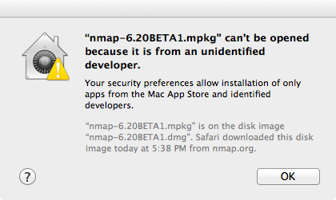
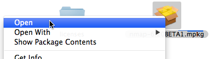
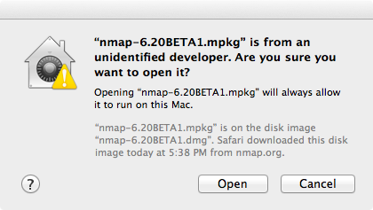

[Download](https://nmap.org/download.html)[Reference Guide](https://nmap.org/book/man.html)[Book](https://nmap.org/book/)[Docs](https://nmap.org/docs.html)[Zenmap GUI](https://nmap.org/zenmap/)[In the Movies](https://nmap.org/movies/)

* [Nmap Network Scanning](https://nmap.org/book/toc.html)
* [Chapter 2. Obtaining, Compiling, Installing, and Removing Nmap](https://nmap.org/book/install.html)
* Apple Mac OS X

[Prev](https://nmap.org/book/inst-windows.html)

[Next](https://nmap.org/book/inst-other-platforms.html)

Apple Mac OS X
----------

Nmap has supported Mac OS X since 2001, and our support has only improved over time. While Mac users can compile Nmap themselves, we also offer an executable installer. Nmap makes use of Jhbuild and gtk-mac-bundler which are used to build other projects for Mac OS X, such as OpenSSL, libapr, libsvn... Nmap is also available through systems such as MacPorts and Fink which package Unix software for Mac OS X.

### Executable Installer ###

The easiest way to install Nmap and Zenmap on Mac OS X is to use
our installer. The[Mac OS X section of
the Nmap download page](https://nmap.org/download.html#macosx) provides a file named`nmap-*`<version>`*.dmg`, where*`<version>`* is the version number of the most
recent release. The`.dmg`file is known as a“disk image”. Installation instructions follow:

1. Download the file`nmap-*`<version>`*.dmg`.
   Double-click the icon to open it. (Depending on how you downloaded the
   file, it may be opened automatically.)

2. The contents of the disk image will be displayed. One of
   the files will be a Mac meta-package file named`nmap-*`<version>`*.mpkg`.
   Open it to start the installer.

   On OS X 10.8 and later, you may see a dialog like[Figure 2.2](https://nmap.org/book/inst-macosx.html#fig-mac-gatekeeper-blocked).

   Figure 2.2. Apple Gatekeeper block screen

   

   If this happens, it is necessary to right-click or control-click on the`.mpkg` and select “Open”,
   as shown in[Figure 2.3](https://nmap.org/book/inst-macosx.html#fig-mac-gatekeeper-open).

   Figure 2.3. Apple Gatekeeper Open menu

   

   A dialog similar to the first will appear, this time having an“Open” button (shown in[Figure 2.4](https://nmap.org/book/inst-macosx.html#fig-mac-gatekeeper-allowed)).
   Click the button to continue.

   Figure 2.4. Apple Gatekeeper Open screen

   

3. Follow the instructions in the
   installer. You will be asked for your password since Nmap installs in a system directory.

4. Once the installer is finished, eject the disk image by
   control-clicking on its icon and selecting“Eject”. The disk image may now be placed in
   the trash.

See the instructions in [the section called “Executing Nmap on Mac OS X”](https://nmap.org/book/inst-macosx.html#inst-macosx-exec) for
help on running Nmap and Zenmap after they are installed.

The programs installed by the installer will run on Intel Mac OS X 10.5
(Leopard) or later. Users of earlier versions will have to compile from
source or use a third-party package. Instructions for PowerPC (PPC) Mac systems (which Apple ceased selling in 2006) are [available on our wiki](https://secwiki.org/w/Nmap/Mac_OSX_PPC).

### Compile from Source Code ###

Compiling Nmap from source on Mac OS X is no more difficult than
on other platforms once a proper build environment is in place.

#### Compile Nmap from source code ####

Compiling Nmap on Mac OS X requires[Xcode](https://developer.apple.com/xcode/),Apple's developer tools that include GCC and the rest of the usual build
system. Xcode is not installed by default, but can be downloaded free of
charge from the [Mac App
Store](https://developer.apple.com/xcode/). After installing Xcode, open“Preferences”, select the“Downloads” tab, and click the“Install” next to “Command Line
Tools”.

Xcode installations don't always include the command line tools. You can install them by opening Xcode from the Applications folder, opening Preferencechoosing the `Download` header icon and clicking the `Install` button next to “Command Line Tools”.

Once you have installed Xcode and the command-line tools, follow the compilation instructions found in [the section called “Linux/Unix Compilation and Installation from Source Code”](https://nmap.org/book/inst-source.html). Note that on some older versions of Mac OS X, you may have to replace the command **./configure** with **./configure CPP=/usr/bin/cpp**. Also, on some newer Mac OS X versions, the libpcap version of the library provided by Apple may be too old. You may have to configure Nmap with the command **./configure --with-libpcap=included** in order to use the compatible version included in Nmap, or you should update the libpcap installed on your machine.

#### Compile Zenmap from source code ####

Zenmap depends on some external libraries that do not come with
Mac OS X, including GTK+ and PyGTK. These libraries have many dependencies
of their own. A convenient way to install all of them is to use a
third-party packaging system as described in[Section ](https://nmap.org/book/inst-macosx.html#inst-macosx-third-party). Once the dependencies are
installed, follow the instructions in [the section called “Linux/Unix Compilation and Installation from Source Code”](https://nmap.org/book/inst-source.html) to
install Zenmap as usual.

### Third-party Packages ###

Another option for installing Nmap is to use a system
which packages Unix software for Mac OS X. The two discussed here are[Fink](http://www.finkproject.org/) and[MacPorts](http://www.macports.org/). See the
respective projects' web sites for how to install the package
managers.

To install using Fink, run the command **fink install
nmap**. Nmap will be installed as`/sw/bin/nmap`. To uninstall use the command**fink remove nmap**.

To install using MacPorts, run **sudo port
install nmap**. Nmap will be installed as`/opt/local/bin/nmap`. To uninstall, run**sudo port uninstall nmap**.

These systems install the `nmap`executable outside the global `PATH`. To enable Zenmap to
find it, set the `nmap_command_path` variable in`zenmap.conf` to `/sw/bin/nmap` or`/opt/local/bin/nmap` as described in[the section called “The `nmap` Executable”](https://nmap.org/book/zenmap-files.html#zenmap-executable).

### Executing Nmap on Mac OS X ###

The terminal emulator in Mac OS X is calledTerminal, and is located in the directory`/Applications/Utilities`. Open it and a
terminal window appears. This is where you will type your commands.

By default the root user is disabled on Mac OS X. To run a scan with
root privileges prefix the command name withsudo,as
in **sudo nmap -sS *`<target>`***.
You will be asked for a password, which is just your normal login
password. Only users with administrator privileges can do this.

Zenmap requires the X11 application to
be installed. If it was not installed by default it may be available as
an optional install on the Mac OS X installation discs.

When Zenmap is started, a dialog is displayed requesting that you
type your password. Users with
administrator privilegesmay enter their
password to allow Zenmap to run as the root user and run more advanced
scans. To run Zenmap in unprivileged mode, select the“Cancel” button on this authentication dialog.

---

[Prev](https://nmap.org/book/inst-windows.html)Windows

[Up](https://nmap.org/book/install.html)Chapter 2. Obtaining, Compiling, Installing, and Removing Nmap

[Home](https://nmap.org/book/toc.html)

[Next](https://nmap.org/book/inst-other-platforms.html)Other Platforms (BSD, Solaris, AIX, AmigaOS)