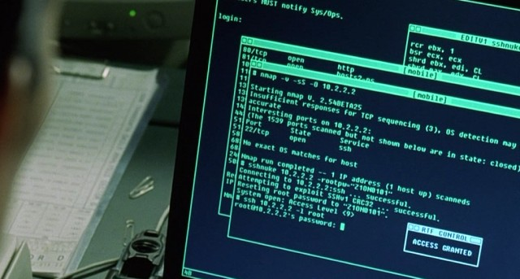

[Download](https://nmap.org/download.html)[Reference Guide](https://nmap.org/book/man.html)[Book](https://nmap.org/book/)[Docs](https://nmap.org/docs.html)[Zenmap GUI](https://nmap.org/zenmap/)[In the Movies](https://nmap.org/movies/)

* [Nmap Network Scanning](https://nmap.org/book/toc.html)
* [Chapter 1. Getting Started with Nmap](https://nmap.org/book/intro.html)
* Nmap Overview and Demonstration

[Prev](https://nmap.org/book/intro.html)

[Next](https://nmap.org/book/nmap-phases.html)

Nmap Overview and Demonstration
----------

Sometimes the best way to understand something is to see it in
action. This section includes examples of
Nmap used in (mostly) fictional yet
typical circumstances. Nmap newbies
should not expect to understand everything at once. This is simply a
broad overview of features that are described in depth in later
chapters. The “solutions” included throughout this book demonstrate many other common Nmap tasks for security auditors and network administrators.

### Avatar Online ###

[]()[]()

Felix dutifully arrives at work on December 15th, although he
does not expect many structured tasks. The small San Francisco
penetration-testing firm he works for has been quiet lately due
to impending holidays. Felix spends business hours pursuing
his latest hobby of building powerful Wi-Fi antennas for wireless
assessments and war driving exploration. Nevertheless, Felix is
hoping for more business. Hacking has been his hobby and fascination
since a childhood spent learning everything he could about networking,
security, Unix, and phone systems. Occasionally his curiosity took
him too far, and Felix was almost swept up in the 1990 Operation
Sundevil prosecutions. Fortunately Felix emerged from adolescence
without a criminal record, while retaining his expert knowledge of
security weaknesses. As a professional, he is able to perform the
same types of network intrusions as before, but with the added benefit
of contractual immunity from prosecution and even a paycheck! Rather
than keeping his creative exploits secret, he can brag
about them to client management when presenting his reports. So Felix
was not disappointed when his boss interrupted his antenna soldering
to announce that the sales department closed a pen-testing
deal with the Avatar Online gaming company.

Avatar Online (AO) is a small company working to create the next
generation of massive multi-player online role-playing games
(MMORPGs). Their product, inspired by the Metaverse envisioned in
Neil Stevenson's *Snow Crash*, is fascinating but
still highly confidential. After witnessing the [high-profile leak](http://www.smh.com.au/articles/2003/10/03/1064988378345.html) of Valve Software's upcoming game source code, AO quickly
hired the security consultants. Felix's task is to initiate an external (from outside
the firewall) vulnerability assessment while his partners work
on physical security, source code auditing, social engineering, and so
forth. Felix is permitted to exploit any vulnerabilities found.

The first step in a vulnerability assessment is network
discovery. This reconnaissance stage determines what IP address
ranges the target is using, what hosts are available, what services
those hosts are offering, general network topology details, and what
firewall/filtering policies are in effect.

Determining the IP ranges to scan would normally be an elaborate
process involving
ARIN[]()(or another geographical registry) lookups, DNS
queries and zone transfer attempts, various web sleuthing techniques,
and more. But in this case, Avatar Online explicitly specified what
networks they want tested: the corporate network on
6.209.24.0/24 and their production/DMZ systems residing on
6.207.0.0/22. Felix checks the IP whois records anyway and
confirms that these IP ranges are allocated to AO[<sup id="idm45818757551952" class="footnote">[1]</sup>](https://nmap.org/book/nmap-overview-and-demos.html#ftn.idm45818757551952). Felix subconsciously
decodes the CIDR notation[<sup id="idm45818757551008" class="footnote">[2]</sup>](https://nmap.org/book/nmap-overview-and-demos.html#ftn.idm45818757551008)[]()[]()and recognizes this as 1,280 IP addresses.
No problem.

Being the careful type, Felix first starts out with what is
known as an Nmap list scan[]() (`-sL` option). This
feature simply enumerates every IP address in the given target
netblock(s) and does a reverse-DNS lookup (unless `-n`was specified) on each. One reason to do this first is stealth. The
names of the hosts can hint at potential vulnerabilities and allow for
a better understanding of the target network, all without raising alarm
bells[<sup id="idm45818757545088" class="footnote">[3]</sup>](https://nmap.org/book/nmap-overview-and-demos.html#ftn.idm45818757545088). Felix is doing this for another reason—to
double-check that the IP ranges are correct. The systems
administrator who provided the IPs might have made a mistake, and
scanning the wrong company would be a disaster. The contract signed
with Avatar Online may act as a get-out-of-jail-free card for
penetrating their networks, but will not help if Felix accidentally
compromises another company's server! The command he uses and an excerpt of
the results are shown in [Example 1.1](https://nmap.org/book/nmap-overview-and-demos.html#ex-felix-list-scan).

Example 1.1. Nmap list scan against Avatar Online IP addresses

[]()

```
felix> nmap -sL 6.209.24.0/24 6.207.0.0/22

Starting Nmap ( https://nmap.org )
Nmap scan report for 6.209.24.0
Nmap scan report for fw.corp.avataronline.com (6.209.24.1)
Nmap scan report for dev2.corp.avataronline.com (6.209.24.2)
Nmap scan report for 6.209.24.3
Nmap scan report for 6.209.24.4
...
Nmap scan report for dhcp-21.corp.avataronline.com (6.209.24.21)
Nmap scan report for dhcp-22.corp.avataronline.com (6.209.24.22)
Nmap scan report for dhcp-23.corp.avataronline.com (6.209.24.23)
...
Nmap scan report for 6.207.0.0
Nmap scan report for gw.avataronline.com (6.207.0.1)
Nmap scan report for ns1.avataronline.com (6.207.0.2)
Nmap scan report for ns2.avataronline.com (6.207.0.3)
Nmap scan report for ftp.avataronline.com (6.207.0.4)
Nmap scan report for 6.207.0.5
Nmap scan report for 6.207.0.6
Nmap scan report for www.avataronline.com (6.207.0.7)
Nmap scan report for 6.207.0.8
...
Nmap scan report for cluster-c120.avataronline.com (6.207.2.120)
Nmap scan report for cluster-c121.avataronline.com (6.207.2.121)
Nmap scan report for cluster-c122.avataronline.com (6.207.2.122)
...
Nmap scan report for 6.207.3.255
Nmap done: 1280 IP addresses (0 hosts up) scanned in 331.49 seconds
felix>

```

Reading over the results, Felix finds that all of the machines
with
reverse-DNS[]()entries resolve to Avatar Online. No other
businesses seem to share the IP space. Moreover, these results
give Felix a rough idea of how many machines are in use and a good
idea of what many are used for. He is now ready to get a bit more
intrusive and try a port scan. He uses Nmap features that try to
determine the application and version number of each service listening
on the network. He also requests that Nmap try to guess the
remote operating system via a series of low-level TCP/IP probes known
as OS fingerprinting. This sort of scan is not at
all stealthy, but that does not concern Felix. He is interested
in whether the administrators of AO even notice these blatant scans. After a
bit of consideration, Felix settles on the following command:

[]()[]()[]()[]()[]()[]()[]()[]()

**nmap -sS -p- -PE -PP -PS80,443 -PA3389 -PU40125 -A -T4 -oA avatartcpscan-%D 6.209.24.0/24 6.207.0.0/22**

These options are described in later chapters, but here is a
quick summary of them.

[]()[`-sS`

Enables the efficient TCP port scanning technique
known as SYN scan. Felix would have added a U at the end if he also
wanted to do a UDP scan, but he is saving that for later. SYN scan is
the default scan type, but stating it explicitly does not
hurt.

`-p-`

Requests that Nmap scan *every* port from
1-65535. This is more comprehensive than the default, which is to scan only the 1,000 ports which we've found to be most commonly accessible in large-scale Internet testing. This option format
is simply a short cut for `-p1-65535`. Felix could have
specified `-p0-65535` if he wanted to scan the rather
illegitimate port zero as well. The `-p` option has a
very flexible syntax, even allowing the specification of a differing
set of UDP and TCP ports.

`-PE -PP -PS80,443 -PA3389 -PU40125`

These are all host discovery techniques (*ping types*) used in
combination to determine which targets on a network are really available and avoid
wasting a lot of time scanning IP addresses that are not in use. This
particular incantation sends ICMP echo request and timestamp request packets; TCP SYN packet to ports 80 and 443; TCP ACK packets to port 3389; and a UDP packet to port 40,125. If Nmap
receives a response from a target host to any of these
probes, it considers the host to be up and available for scanning.
This is the most effective six-probe combination that we've found in large-scale empirical testing for host discovery against targets over the Internet. It is more extensive than the Nmap default, which is `-PE -PS443 -PA80 -PP`. In a pen-testing situation,
you often want to scan every host even if they do not seem to be up.
After all, they could just be heavily filtered in such a way that the
probes you selected are ignored but some other obscure port may be
available. To scan every IP whether it shows an available host or
not, specify the `-Pn` option instead of all of the above.
Felix starts such a scan in the background, though it may take many hours
to complete.

`-A`

This shortcut option turns on *A*dvanced and *A*ggressive features such as OS and service
detection. At the time of this writing it is equivalent to`-sV` `-sC` `-O` `--traceroute` (version detection, Nmap Scripting Engine with the default set of scripts, remote OS detection, and traceroute). More features may
be added to `-A` later.

`-T4`]()

[Since such a comprehensive scan against more than a thousand IP addresses
could take a while, Felix simply starts it executing and resumes work
on his Yagi antenna. An couple hours later he notices that it has
finished and takes a peek at the results. ]()[Example 1.2](https://nmap.org/book/nmap-overview-and-demos.html#ex-felix-scan1) shows one of the machines discovered.

Example 1.2. Nmap results against an AO firewall

```
Nmap scan report for fw.corp.avataronline.com (6.209.24.1)
(The 65530 ports scanned but not shown below are in state: filtered)
PORT     STATE  SERVICE    VERSION
22/tcp   open   ssh        OpenSSH 3.7.1p2 (protocol 1.99)
| ssh-hostkey: 1024 7c:14:2f:92:ca:61:90:a4:11:3c:47:82:d5:8e:a9:6b (DSA)
|_2048 41:cf7d:839d:7f66:0ae1:8331:7fd4:5a97:5a (RSA)
|_sshv1: Server supports SSHv1
53/tcp   open   domain     ISC BIND 9.2.1
110/tcp  open   pop3       Courier pop3d
113/tcp  closed auth
143/tcp  open   imap       Courier Imap 1.6.X - 1.7.X
3128/tcp open   http-proxy Squid webproxy 2.2.STABLE5
Device type: general purpose
Running: Linux 2.4.X|2.5.X
OS details: Linux Kernel 2.4.0 - 2.5.20
Uptime 3.134 days

```

To the trained eye, this conveys substantial information about
AO's security posture. Felix first notes the reverse DNS
name—this machine is apparently meant to be a firewall for their
corporate network. The next line is important, but all too often
ignored. It states that the vast majority of the ports on this
machine are in the`filtered`[]()[]()state. This means that Nmap is unable
to reach the port because it is blocked by firewall rules. The fact
that all ports except for a few chosen ones are in this state is a
sign of security competence.
Deny-by-default[]()is a security mantra for
good reasons—it means that even if someone accidentally left SunRPC
(port 111) open on this machine, the firewall rules would prevent
attackers from communicating with it.

Felix then looks at every port line in turn. The first port is
Secure Shell (OpenSSH). Version 3.7.1p2 is common, as many
administrators upgraded to this version due to potentially exploitable
buffer management bugs affecting previous versions. Nmap also notes
that the`sshv1`[]()NSE script reports that the less secure SSHv1 protocol
is supported. A truly paranoid sysadmin would only allow SSH
connections from certain trusted IP addresses, but one can argue for
open access in case the administrator needs emergency access while far
from home. Security often involves trade-offs, and this one may be
justifiable. Felix makes a note to try the [Ncrack brute force network authentication cracker](https://nmap.org/ncrack/) and especially his private timing-based SSH user enumeration
tool against the server.

Felix also notes port 53. It is running ISC
BIND, which has a long history of remotely exploitable security holes.
Visit the [BIND security page](http://www.isc.org/products/BIND/bind-security.html)for further details. BIND 9.2.1 even has a potentially exploitable
buffer overflow, although the default build is not vulnerable. Felix
checks and finds that this server is not vulnerable to the libbind
issue, but that is beside the point. This server almost certainly
should not be running an externally-accessible nameserver. A firewall
should only run the bare essentials to minimize the risk of a
disastrous compromise. Besides, this server is not authoritative for
any domains—the real nameservers are on the production network. An
administrator probably only meant for clients within the firewall to
contact this nameserver, but did not bother locking it down to only
the internal interface. Felix will later try to gather important
information from this unnecessary server using zone transfer requests
and intrusive queries. He may attempt cache poisoning as well. By
spoofing the IP of `windowsupdate.microsoft.com` or
another important download server, Felix may be able to trick
unsuspecting internal client users into running a trojan-horse program
that provides him with full network access behind the firewall.

The next two open ports are 110 (POP3) and 143 (IMAP). Note
that 113 (auth) between them is`closed`[]()[]()instead of`open`.[]()[]()POP3 and IMAP are mail retrieval
services which, like BIND, have no legitimate place on this server.
They are also a security risk in that they generally transfer the mail
and (even worse) authentication credentials unencrypted. Users
should probably VPN in and check their mail from an internal server.
These ports could also be wrapped in SSL encryption. Nmap would have
then listed the services as `ssl/pop3` and `ssl/imap`. Felix will try
his user enumeration and password guessing attacks on these services,
which will probably be much more effective than against SSH.

The final open port is a Squid
proxy.[]()This is another service
that may have been intended for internal client use and should not be
accessible from the outside (and particularly not on the firewall).
Felix's initially positive opinion of the AO security administrators
drops further. Felix will test whether he can abuse this proxy to
connect to other sites on the Internet. Spammers and malicious
hackers often use proxies in this way to hide their tracks. Even more
critical, Felix will try to proxy his way into the*internal* network. This common attack is how[Adrian Lamo](http://en.wikipedia.org/wiki/Adrian_Lamo)broke into the New York Times internal network in 2002. Lamo was
caught after he called reporters to brag about his exploits against
the NY Times and other companies [in detail](http://www.securityfocus.com/news/340).

The following lines disclose that this is a Linux box, which is
valuable information when attempting exploitation. The low three-day
uptime was detected during OS fingerprinting by sending several probes
for the TCP timestamp option value and extrapolating the line back to
zero.

Felix then examines the Nmap output for another machine, as
shown in [Example 1.3](https://nmap.org/book/nmap-overview-and-demos.html#ex-felix-scan2).

Example 1.3. Another interesting AO machine

```
Nmap scan report for dhcp-23.corp.avataronline.com (6.209.24.23)
(The 65526 ports scanned but not shown below are in state: closed)
PORT      STATE    SERVICE       VERSION
135/tcp   filtered msrpc
136/tcp   filtered profile
137/tcp   filtered netbios-ns
138/tcp   filtered netbios-dgm
139/tcp   filtered netbios-ssn
445/tcp   open     microsoft-ds  Microsoft Windows XP microsoft-ds
1002/tcp  open     windows-icfw?
1025/tcp  open     msrpc         Microsoft Windows msrpc
16552/tcp open     unknown
Device type: general purpose
Running: Microsoft Windows NT/2K/XP
OS details: Microsoft Windows XP Professional RC1+ through final release

Host script results:
|_nbstat: NetBIOS name: TRACYD, NetBIOS user: <unknown>,  NetBIOS MAC: 00:20:35:00:29:a2:7f (IBM)
|_smbv2-enabled: Server doesn't support SMBv2 protocol
| smb-os-discovery:  
|   OS: Windows XP (Windows 2000 LAN Manager)
|_  Name: WORKGROUP\JOHND

```

Felix smiles when he spies this Windows XP box on the Network.
Thanks to a spate of MS RPC vulnerabilities, those machines are
trivial to compromise if the OS patches aren't up-to-date. The second
line shows that the default state is `closed`,
meaning the firewall does not have the same
deny-by-default[]()policy for
this machine as for itself. Instead they tried to specifically block
the Windows ports they consider dangerous on 135-139. This filter is
woefully inadequate, as MS exports MS RPC functionality on many other
ports in Windows XP. TCP ports 445 and 1025 are two examples from
this scan. While Nmap failed to recognize 16552, Felix has seen this
pattern enough to know that it is probably the MS Messenger Service.
If AO had been using deny-by-default filtering, port 16552 would not
be accessible in the first place. Looking through the results page,
Felix sees several other Windows machines on this DHCP network. Felix
cannot wait to try his favorite DCOM RPC exploit against them. It was
written by HD Moore and is available at[`http://www.metasploit.com/tools/dcom.c`](http://www.metasploit.com/tools/dcom.c). If that
fails, there are a couple newer MS RPC vulnerabilities he will
try.

Felix continues poring over the results for vulnerabilities he
can leverage to compromise the network. On the production network, he
sees that `gw.avataronline.com` is a Cisco router that also acts as a
rudimentary firewall for the systems. They fall into the trap of only
blocking privileged ports (those under 1024), which leaves a bunch
of vulnerable SunRPC and other services accessible on that network.
The machines with names like `clust-*` each have dozens of ports open
that Nmap does not recognize. They are probably custom daemons
running the AO game engine. `www.avataronline.com` is a Linux box with an open Apache server on the
HTTP and HTTPS ports. Unfortunately, it is linked with an exploitable
version of the OpenSSL library. Oops! Before the sun sets, Felix has
gained privileged access to hosts on both the corporate and production
networks.

*As Felix has demonstrated, Nmap is frequently used by
security auditors and network administrators to help locate
vulnerabilities on client/corporate networks. Subsequent chapters
describe the techniques used by Felix, as well as many other Nmap
features, in much greater detail.*

[]()

### Saving the Human Race ###

Figure 1.1. Trinity begins her assault


Trinity[]()is in quite a pickle! Having discovered that the world
we take for granted is really a virtual“Matrix”[]()run by machine
overlords, Trinity decides to fight back and free the human race from
this mental slavery. Making matters worse, her underground colony of
freed humans (Zion) is under attack by 250,000 powerful alien
sentinels. Her only hope involves deactivating the emergency power
system for 27 city blocks in less than five minutes. The previous team
died trying. In life's bleakest moments when all hope seems to be
lost, what should you turn to? Nmap, of course! But not quite yet.

She first must defeat the perimeter security, which on
many networks involves firewalls and intrusion detection systems
(IDS). She is well aware of advanced techniques for circumventing
these devices (covered later in this book). Unfortunately, the
emergency power system administrators knew better than to connect such a
critical system to the Internet, even indirectly. No amount of source
routing or IP ID spoofed scanning will help Trinity overcome this “air
gap” security. Thinking fast, she devises a clever plan that involves jumping her
motorcycle off the rooftop of a nearby building, landing on the power
station guard post, and then beating up all of the security guards.
This advanced technique is not covered in any physical security
manual, but proves highly effective. It demonstrates how clever hackers research and devise their own attacks, rather than always utilizing the
script-kiddie[]()approach of canned exploits.

Trinity fights her way to the computer room and sits down at a
terminal. She quickly determines that the network is using the private
10.0.0.0/8 network address space. A ping to the network
address generates responses from dozens of machines. An Nmap ping
scan would have provided a more comprehensive list of available
machines, but using the broadcast technique saved precious seconds.
Then she whips out Nmap[<sup id="idm45818757439696" class="footnote">[5]</sup>](https://nmap.org/book/nmap-overview-and-demos.html#ftn.idm45818757439696). The terminal has version 2.54BETA25
installed. This version is ancient (2001) and less efficient than
newer releases, but Trinity had no time to install a better version
from the future. This job will not take long anyway. She runs the
command **nmap -v -sS -O 10.2.1.3**. This executes a TCP SYN scan
and OS detection against 10.2.1.3 and provides verbose output. The
host appears to be a security disaster—AIX 3.2 with well over a
dozen ports open. Unfortunately, this is not the machine she needs to
compromise. So she runs the same command against 10.2.2.2. This time
the target OS is unrecognized (she should have upgraded Nmap!) and
only has port 22 open. This is the Secure Shell encrypted
administration service. As any sexy latex-clad hacker goddess knows,
many SSH servers from around that time (2001) have an exploitable
vulnerability in the CRC32 compensation attack detector. Trinity
whips out an all-assembly-code exploit and utilizes it to change the root password of the
target box to `Z10N0101`. Trinity uses much more secure passwords
under normal circumstances. She logs in as root and issues a command
to disable the emergency backup power system for 27 city blocks,
finishing just in time! Here is a shot of the action:

Figure 1.2. Trinity scans the Matrix



A terminal-view
video showing the whole hack is available at [`https://nmap.org/movies.html`](https://nmap.org/movies.html), unless the
MPAA finds out and sends sentinels or lawyers after us.

### MadHat in Wonderland ###

[]()

This story differs from the previous ones in that it is actually
true. Written by frequent Nmap user and contributor
Lee “MadHat” Heath, it describes how he enhanced and
customized Nmap for daily use in a large enterprise. In true open
source spirit, he has released these valuable
scripts [on his Web
site](http://www.unspecific.com/nmap/). IP addresses have been changed to protect the corporate
identity. The remainder of this section is in his own words.

After spending the past couple of decades learning computers and working
my way up from tech support through sysadmin and into my dream job of
Information Security Officer for a major Internet company, I found
myself with a problem. I was handed the sole responsibility of
security monitoring for our entire IP space. This was almost 50,000
hosts worldwide when I started several years ago, and it has doubled
since then.

Scanning all of these machines for potential vulnerabilities as
part of monthly or quarterly assessments would be tough enough, but
management wanted it done daily. Attackers will not wait a week or
month to exploit a newly exposed vulnerability, so I can't wait that
long to find and patch it either.

Looking around for tools, I quickly chose Nmap as my port
scanner. It is widely considered to be the best scanner, and I had already
been using it for years to troubleshoot networks and test security.
Next I needed software to aggregate Nmap output and print
differences between runs. I considered several existing tools, including HD Moore's[Nlog](http://www.securiteam.com/tools/3T5QMQ0NFK.html). Unfortunately none of these monitored changes in the way I
desired. I had to know whenever a router or firewall access control list
was misconfigured or a host was publicly sharing inappropriate
content. I also worried about the scalability of these other solutions,
so I decided to tackle the problem myself.

The first issue to come up was speed. Our networks are located
worldwide, yet I was provided with only a single U.S.-based host to do
the scanning. In many cases, firewalls between the sites slowed the
scanning down significantly. Scanning all 100,000 hosts took over 30
hours, which is unacceptable for a daily scan. So I wrote a script
called nmap-wrapper which runs dozens of
Nmap processes in parallel, reducing the scan time to fifteen hours,
even including OS detection.

The next problem was dealing with so much data. A SQL
database seemed like the best approach for scalability and data-mining
reasons, but I had to abandon that idea due to time pressures. A
future version may add this support. Instead, I used a flat file to
store the results of each class C address range for each day. The
most powerful and extensible way to parse and store this information was
the Nmap XML format, but I chose the “grepable”(`-oG` option)[]()[]()format because it is so easy to parse from simple scripts. Per-host
timestamps are also stored for reporting purposes. These have proven
quite helpful when administrators try to blame machine or service
crashes on the scanner. They cannot credibly claim a service crash at 7:12AM
when I have proof that the scan ran at 9:45AM.

The scan produces copious data, with no convenient
access method. The standard Unix **diff** tool is not
smart enough to report only the changes I care about, so I wrote a
Perl script namednmap-diff[]()to provide
daily change reports. A typical output report is shown in [Example 1.4](https://nmap.org/book/nmap-overview-and-demos.html#ex-madhat-nmap-diff).

Example 1.4. nmap-diff typical output

[]()

```
> nmap-diff.pl -c3
  5 IPs showed changes

  10.12.4.8 (ftp-box.foocompany.biz)
         21/tcp   open   ftp
         80/tcp   open   http
        443/tcp   open   https
       1027/tcp   open   IIS
     + 1029/tcp   open   ms-lsa
      38292/tcp   open   landesk-cba
  OS: Microsoft Windows Millennium Edition (Me)
      Windows 2000 Professional or Advanced Server
      or Windows XP

  10.16.234.3 (media.foocompany.biz)
         80/tcp   open   http
     +  554/tcp   open   rtsp
     + 7070/tcp   open   realserver

  192.168.10.186 (testbox.foocompany.biz)
    + 8082/tcp   open   blackice-alerts
  OS: Linux Kernel 2.4.0 - 2.5.20

  172.24.12.58 (mtafoocompany.biz)
    +   25/tcp   open   smtp
  OS: FreeBSD 4.3 - 4.4PRERELEASE

  172.23.76.22 (media2.foocorp.biz)
         80/tcp   open   http
       1027/tcp   open   IIS
     + 1040/tcp   open   netsaint
       1755/tcp   open   wms
       3372/tcp   open   msdtc
       6666/tcp   open   irc-serv
       7007/tcp   open   afs3-bos
  OS: Microsoft Windows Millennium Edition (Me)
      Windows 2000 Professional or Advanced Server
      or Windows XP

```

Management and staff were impressed when I demonstrated this new system
at an internal company security symposium. But instead of allowing me
to rest on my laurels, they began asking for new features. They
wanted counts of mail and web servers, growth estimates, and more.
This data was all available from the scans, but was difficult to
access. So I created yet another Perl script,nmap-report,[]()which made querying the data
much easier. It takes specifications such as open
ports or operating systems and finds all the systems that matched on a
given day.

One problem with this approach to security monitoring is that
employees do not always place services on their IANA-registered
official ports. For example, they might put a web server on port 22
(SSH) or vice versa. Just as I was debating how to address this
problem, Nmap came out with an advanced service and version detection
system (see [Chapter 7, *Service and Application Version Detection*](https://nmap.org/book/vscan.html)). nmap-report now
has a rescan feature that uses version scanning to report the
true services rather than guessing based on port number. I hope to
further integrate version detection in future versions. [Example 1.5](https://nmap.org/book/nmap-overview-and-demos.html#ex-madhat-nmap-report) shows nmap-reportlisting FTP servers.

Example 1.5. nmap-report execution

[]()

```
> nmap-report -p21 -rV
[...]
172.21.199.76 (ftp1.foocorp.biz)
   21/tcp   open   ssl|ftp Serv-U ftpd 4.0

192.168.12.56 (ftp2.foocorp.biz)
   21/tcp   open   ftp     NcFTPd

 192.168.13.130 (dropbox.foocorp.biz)
   21/tcp   open   ftp     WU-FTPD 6.00LS

```

While being far from perfect, these scripts have proven themselves
quite valuable at monitoring large networks for security-impacting changes.
Since Nmap itself is open source, it only seemed fair to release my
scripts to the public as well. I have made them freely available at[`http://www.unspecific.com/nmap`](http://www.unspecific.com/nmap).

---

[<sup class="para">[1] </sup>](https://nmap.org/book/nmap-overview-and-demos.html#idm45818757551952)These IP addresses are
actually registered to the United States Army Yuma Proving Ground, which is
used to test a wide variety of artillery, missiles, tanks, and other
deadly weapons. The moral is to be very careful about who you scan,
lest you accidentally hit a highly sensitive network. The scan
results in this story are not actually from this IP
range.

[<sup class="para">[2] </sup>](https://nmap.org/book/nmap-overview-and-demos.html#idm45818757551008)Classless Inter-Domain Routing
(CIDR) notation is a method for describing networks with more
granularity than class A (CIDR /8), class B (CIDR /16), or class C
(CIDR /24) notation. See[`https://en.wikipedia.org/wiki/Classless_Inter-Domain_Routing`](https://en.wikipedia.org/wiki/Classless_Inter-Domain_Routing).

[<sup class="para">[3] </sup>](https://nmap.org/book/nmap-overview-and-demos.html#idm45818757545088)It is possible that the target nameserver will
log a suspicious bunch of reverse-DNS queries from Felix's nameserver,
but most organizations don't even keep such logs, much less analyze
them.

[<sup class="para">[4] </sup>](https://nmap.org/book/nmap-overview-and-demos.html#idm45818757501632)stdout is the “C” notation for representing the standard output mechanism for a system, such as to the Unix xterm or Windows command window in which Nmap was initiated.

[<sup class="para">[5] </sup>](https://nmap.org/book/nmap-overview-and-demos.html#idm45818757439696)A sexy leather-clad attacker
from the previous team actually started the session. It is unclear at
what point she died and left the remaining tasks to
Trinity.

---

[Prev](https://nmap.org/book/intro.html)Chapter 1. Getting Started with Nmap

[Up](https://nmap.org/book/intro.html)Chapter 1. Getting Started with Nmap

[Home](https://nmap.org/book/toc.html)

[Next](https://nmap.org/book/nmap-phases.html)The Phases of an Nmap Scan