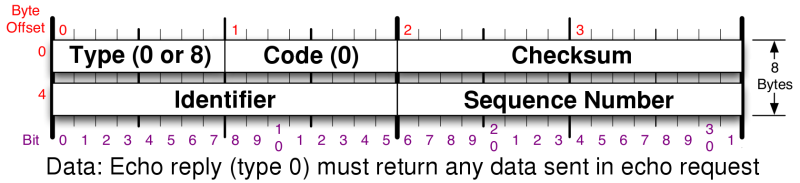

Blocked for possible web abuse

Blocked for possible web abuse
==========

The IP address you are coming from has requested an inordinately large number of pages in a short amount of time and has been temporarily blocked to conserve our resources. This often happens when people try to use web spidering programs to download large portions of the site. The block will be removed 24 hours after the latest period of high traffic. If you feel this IP ban was made in error, you can email fyodor@nmap.org.

* [Nmap Network Scanning](https://nmap.org/book/toc.html)
* [Chapter 8. Remote OS Detection](https://nmap.org/book/osdetect.html)
* TCP/IP Fingerprinting Methods Supported by Nmap

[Prev](https://nmap.org/book/osdetect-usage.html)

[Next](https://nmap.org/book/osdetect-ipv6-methods.html)

TCP/IP Fingerprinting Methods Supported by Nmap
----------

Nmap OS fingerprinting works by sending up to 16 TCP, UDP, and ICMP
probes to known open and closed ports of the target machine.
These probes are specially designed to exploit various ambiguities in
the standard protocol RFCs. Then Nmap listens for responses. Dozens of attributes in those responses are analyzed and
combined to generate a fingerprint. Every probe packet is tracked and
resent at least once if there is no response. All of the packets are
IPv4 with a random IP ID value. Probes to an open TCP port are skipped
if no such port has been found. For closed TCP or UDP ports, Nmap
will first check if such a port has been found. If not, Nmap will
just pick a port at random and hope for the best.

The following sections are highly technical and reveal the
hidden workings of Nmap OS detection. Nmap can be used effectively
without understanding this, though the material can help you better
understand remote networks and also detect and explain certain
anomalies. Plus, some of the techniques are pretty cool. Readers in
a hurry may skip to [the section called “Dealing with Misidentified and Unidentified Hosts”](https://nmap.org/book/osdetect-unidentified.html). But
for those of you who are ready for a journey through TCP explicit
congestion notification, reserved UDP header bits, initial sequence
numbers, bogus flags, and Christmas tree packets: read on!

Even the best of us occasionally forget byte offsets for packet
header fields and flags. For quick reference, the IPv4, TCP, UDP, and ICMP header layouts can be found in [the section called “TCP/IP Reference”](https://nmap.org/book/tcpip-ref.html). The layout for ICMP echo request and destination unreachable packets are shown in [Figure 8.1](https://nmap.org/book/osdetect-methods.html#osdetect-fig-icmp-echo-hdr) and [Figure 8.2](https://nmap.org/book/osdetect-methods.html#osdetect-fig-icmp-du-hdr).

Figure 8.1. ICMP echo request or reply header layout

[

Figure 8.2. ICMP destination unreachable header layout

]()

[

### Probes Sent ###

]()

This section describes each IP probe sent by Nmap as part of
TCP/IP fingerprinting. It refers to Nmap response tests and TCP options which are explained in the following section.

#### Sequence generation (`SEQ`, `OPS`, `WIN`, and `T1`) ####

A series of six TCP probes is sent to generate these four test response lines. The probes are sent exactly 100 milliseconds apart so the total time taken is 500 ms. Exact timing is important as some of the sequence algorithms we detect (initial sequence numbers, IP IDs, and TCP timestamps) are time dependent. This timing value was chosen to take 500 ms so that we can reliably detect the common 2 Hz TCP timestamp sequences.

Each probe is a TCP SYN packet to a detected open port on the remote machine. The sequence and acknowledgment numbers are random (but saved so Nmap can differentiate responses). Detection accuracy requires probe consistency, so there is no data payload even if the user requested one with `--data-length`.

These packets vary in the TCP options they use and the TCP window field value. The following list provides the options and values for all six packets. The listed window field values do not reflect window scaling. EOL is the end-of-options-list option, which many sniffing tools don't show by default.

* **Packet #1:** window scale (10), NOP, MSS (1460), timestamp (TSval: 0xFFFFFFFF; TSecr: 0), SACK permitted. The window field is 1.

* **Packet #2:** MSS (1400), window scale (0), SACK permitted, timestamp (TSval: 0xFFFFFFFF; TSecr: 0), EOL. The window field is 63.

* **Packet #3:** Timestamp (TSval: 0xFFFFFFFF; TSecr: 0), NOP, NOP, window scale (5), NOP, MSS (640). The window field is 4.

* **Packet #4:** SACK permitted, Timestamp (TSval: 0xFFFFFFFF; TSecr: 0), window scale (10), EOL. The window field is 4.

* **Packet #5:** MSS (536), SACK permitted, Timestamp (TSval: 0xFFFFFFFF; TSecr: 0), window scale (10), EOL. The window field is 16.

* **Packet #6:** MSS (265), SACK permitted, Timestamp (TSval: 0xFFFFFFFF; TSecr: 0). The window field is 512.

The results
of these tests include four result category lines. The first,`SEQ`, contains results based on sequence analysis
of the probe packets. These test results are `GCD`,`SP`, `ISR`, `TI`,`II`, `TS`, and`SS`.The next line, `OPS`contains the TCP options received for each of the probes (the test names
are`O1` through `06`).Similarly, the `WIN` line contains window sizes for the probe responses (named`W1` through `W6`).The final line related to these probes,`T1`, contains various test values for packet #1.
Those results are for the `R`, `DF`,`T`, `TG`, `W`,`S`, `A`, `F`,`O`, `RD`, and `Q`tests.These tests are only reported for the first probe since they are almost always the same for each probe.

#### ICMP echo (`IE`) ####

The `IE` test involves sending two ICMP echo request packets to the target. The first one has the IP DF bit set, a type-of-service (TOS) byte value of zero, a code of nine (even though it should be zero), the sequence number 295, a random IP ID and ICMP request identifier, and 120 bytes of 0x00 for the data payload.

The second ping query is similar, except a TOS of four (`IP_TOS_RELIABILITY`) is used, the code is zero, 150 bytes of data is sent, and the ICMP request ID and sequence numbers are incremented by one from the previous query values.

The results of both of these probes are combined into a `IE` line containing the `R`, `DFI`, `T`, `TG`, and `CD` tests. The `R` value is only true (Y) if both probes elicit responses. The `T`, and `CD` values are for the response to the first probe only, since they are highly unlikely to differ. `DFI` is a custom test for this special dual-probe ICMP case.

These ICMP probes follow immediately after the TCP sequence probes to ensure valid results of the shared IP ID sequence number test (see [the section called “Shared IP ID sequence Boolean (`SS`)”](https://nmap.org/book/osdetect-methods.html#osdetect-ss)).

#### TCP explicit congestion notification (`ECN`) ####

This probe tests for explicit congestion notification (ECN) support in the target TCP stack. ECN is a method for improving Internet performance by allowing routers to signal congestion problems before they start having to drop packets. It is documented in [RFC 3168](http://www.rfc-editor.org/rfc/rfc3168.txt). Nmap tests this by sending a SYN packet which also has the ECN CWR and ECE congestion control flags set. For an unrelated (to ECN) test, the urgent field value of 0xF7F5 is used even though the urgent flag is not set. The acknowledgment number is zero, sequence number is random, window size field is three, and the reserved bit which immediately precedes the CWR bit is set. TCP options are WScale (10), NOP, MSS (1460), SACK permitted, NOP, NOP. The probe is sent to an open port.

If a response is received, the `R`, `DF`, `T`, `TG`, `W`, `O`, `CC`, and `Q` tests are performed and recorded.

#### TCP (`T2`–`T7`) ####

The six `T2` through `T7` tests each send one TCP probe packet. With one exception, the TCP options data in each case is (in hex) `03030A0102040109080AFFFFFFFF000000000402`. Those 20 bytes correspond to window scale (10), NOP, MSS (265), Timestamp (TSval: 0xFFFFFFFF; TSecr: 0), then SACK permitted. The exception is that `T7` uses a Window scale value of 15 rather than 10. The variable characteristics of each probe are described below:

* **T2** sends a TCP null (no flags set) packet with the IP DF bit set and a window field of 128 to an open port.

* **T3** sends a TCP packet with the SYN, FIN, URG, and PSH flags set and a window field of 256 to an open port. The IP DF bit is not set.

* **T4** sends a TCP ACK packet with IP DF and a window field of 1024 to an open port.

* **T5** sends a TCP SYN packet without IP DF and a window field of 31337 to a closed port.

* **T6** sends a TCP ACK packet with IP DF and a window field of 32768 to a closed port.

* **T7** sends a TCP packet with the FIN, PSH, and URG flags set and a window field of 65535 to a closed port. The IP DF bit is not set.

In each of these cases, a line is added to the fingerprint with
results for the `R`, `DF`,`T`, `TG`, `W`,`S`, `A`, `F`,`O`, `RD`, and `Q`tests.

#### UDP (`U1`) ####

This probe is a UDP packet sent to a closed port. The character ‘C’ (0x43) is repeated 300 times for the data field. The IP ID value is set to 0x1042 for operating systems which allow us to set this. If the port is truly closed and there is no firewall in place, Nmap expects to receive an ICMP port unreachable message in return. That response is then subjected to the `R`, `DF`, `T`, `TG`, `IPL`, `UN`, `RIPL`, `RID`, `RIPCK`, `RUCK`, and `RUD` tests.

### Response Tests ###

The previous section describes probes sent by Nmap, and this
one completes the puzzle by describing the barrage of tests performed
on responses. The short names (such as `DF`,`R`, and `RIPCK`) are those used in the`nmap-os-db`fingerprint database to save space. All
numerical test values are given in hexadecimal notation, without
leading zeros, unless noted otherwise. The tests are documented in roughly the order they appear in fingerprints.

#### TCP ISN greatest common divisor (`GCD`) ####

The `SEQ` test sends six TCP SYN packets to an
open port of the target machine and collects SYN/ACK packets back.
Each of these SYN/ACK packets contains a 32-bit initial sequence
number (ISN). This test attempts to determine the smallest number by
which the target host increments these values. For example, many
hosts (especially old ones) always increment the ISN in multiples of
64,000.

The first step in calculating this is creating an array of
differences between probe responses. The first element is the
difference between the 1st and 2nd probe response ISNs. The second
element is the difference between the 2nd and 3rd responses. There
are five elements if Nmap receives responses to all six probes. Since
the next couple of sections reference this array, we will call it`diff1`. If an ISN is lower than the previous one,
Nmap looks at both the number of values it would have to subtract from
the first value to obtain the second, and the number of values it
would have to count up (including wrapping the 32-bit counter back to
zero). The smaller of those two values is stored in`diff1`. So the difference between 0x20000 followed
by 0x15000 is 0xB000. The difference between 0xFFFFFF00 and 0xC000 is
0xC0FF. This test value then records the greatest common divisor
of all those elements. This `GCD` is also used for
calculating the `SP` result.

#### TCP ISN counter rate (`ISR`) ####

This value reports the average rate of increase for the returned
TCP initial sequence number. Recall that a difference is taken between each two
consecutive probe responses and stored in the previously discussed`diff1` array. Those differences are each divided by
the amount of time elapsed (in seconds—will generally be about 0.1)
between sending the two probes which generated them. The result is
an array, which we'll call `seq_rates` containing the rates of ISN counter increases per second. The array has one element for each `diff1` value. An average is taken of the array values. If that average is less than one (e.g. a constant ISN is
used), `ISR` is zero. Otherwise`ISR` is eight times the binary logarithm (log base-2) of that
average value, rounded to the nearest integer.

#### TCP ISN sequence predictability index (`SP`) ####

While the `ISR` test measures the average rate
of initial sequence number increments, this value measures the ISN
variability. It roughly estimates how difficult it would be to
predict the next ISN from the known sequence of six probe responses.
The calculation uses the difference array (`seq_rates`)
and `GCD` values discussed in the previous section.

This test is only performed if at least four responses were seen.
If the previously computed `GCD` value is greater
than nine, the elements of the previously computed`seq_rates` array are divided by that value. We
don't do the division for smaller GCD values because those are usually
caused by chance. A [standard
deviation](http://en.wikipedia.org/wiki/Standard_deviation) of the array of the resultant values is then taken.
If the result is one or less, `SP` is zero.
Otherwise the binary logarithm of the result is computed, then it is
multiplied by eight, rounded to the nearest integer, and stored as`SP`.

Please keep in mind that this test is only done for OS
detection purposes and is not a full-blown audit of the target ISN
generator. There are many algorithm weaknesses that lead to easy
predictability even with a high `SP` value.

#### IP ID sequence generation algorithm (`TI`, `CI`, `II`) ####

There are three tests that examine the IP header ID field of
responses. `TI` is based on responses to the TCP`SEQ` probes. `CI` is from the
responses to the three TCP probes sent to a closed port:`T5`, `T6`, and `T7`.`II` comes from the ICMP responses to the two`IE` ping probes. For `TI`, at least
three responses must be received for the test to be included; for`CI`, at least two responses are required; and for`II`, both ICMP responses must be received.

For each of these tests, the target's IP ID generation algorithm
is classified based on the algorithm below. Minor differences between
tests are noted. Note that difference values assume that
the counter can wrap. So the difference between an IP ID of 65,100
followed by a value of 700 is 1,136. The difference between 2,000
followed by 1,100 is 64,636. Here are the calculation details:

1. If all of the ID numbers are zero, the value of the test is `Z`.

2. If the IP ID sequence ever increases by at least 20,000, the value is `RD` (random). This result isn't possible for `II` because there are not enough samples to support it.

3. If all of the IP IDs are identical, the test is set to that value in hex.

4. If any of the differences between two consecutive IDs exceeds 1,000, and is not evenly divisible by 256, the test's value is `RI` (random positive increments). If the difference is evenly divisible by 256, it must be at least 256,000 to cause this `RI` result.

5. If all of the differences are divisible by 256 and no greater than 5,120, the test is set to `BI` (broken increment). This happens on systems like Microsoft Windows where the IP ID is sent in host byte order rather than network byte order. It works fine and isn't any sort of RFC violation, though it does give away host architecture details which can be useful to attackers.

6. If all of the differences are less than ten, the value is `I` (incremental). We allow difference up to ten here (rather than requiring sequential ordering) because traffic from other hosts can cause sequence gaps.

7. If none of the previous steps identify the generation algorithm, the test is omitted from the fingerprint.

#### Shared IP ID sequence Boolean (`SS`) ####

This Boolean value records whether the target shares its IP ID sequence
between the TCP and ICMP protocols. If our six TCP IP ID values are
117, 118, 119, 120, 121, and 122, then our ICMP results are 123 and 124,
it is clear that not only are both sequences incremental, but they are
both part of the same sequence. If, on the other hand, the TCP IP ID
values are 117–122 but the ICMP values are 32,917 and 32,918, two
different sequences are being used.

This test is only included if `II` is`RI`, `BI`, or `I`and `TI` is the same. If `SS` is
included, the result is `S` if the sequence is shared
and `O` (other) if it is not. That determination is
made by the following algorithm:

Let `avg` be the final TCP sequence response
IP ID minus the first TCP sequence response IP ID, divided by the
difference in probe numbers. If probe #1 returns an IP ID of 10,000
and probe #6 returns 20,000, `avg` would be (20,000 −
10,000) / (6 − 1), which equals 2,000.

If the first ICMP echo response IP ID is less than the final TCP
sequence response IP ID plus three times `avg`, the`SS` result is `S`. Otherwise it is`O`.

#### TCP timestamp option algorithm (`TS`) ####

`TS` is another test which attempts todetermine target OS characteristics based on how it generates a
series of numbers. This one looks at the TCP timestamp option (if
any) in responses to the `SEQ` probes. It examines
the TSval (first four bytes of the option) rather than the echoed
TSecr (last four bytes) value. It takes the difference between each
consecutive TSval and divides that by the amount of time elapsed
between Nmap sending the two probes which generated those responses.
The resultant value gives a rate of timestamp increments per second.
Nmap computes the average increments per second over all consecutive
probes and then calculates the `TS` as
follows:

1. If any of the responses have no timestamp option, `TS` is set to `U` (unsupported).

2. If any of the timestamp values are zero, `TS` is set to `0`.

3. If the average increments per second falls within the ranges `0-5.66`, `70-150`, or `150-350`, `TS` is set to 1, 7, or 8, respectively. These three ranges get special treatment because they correspond to the 2 Hz, 100 Hz, and 200 Hz frequencies used by many hosts.

4. In all other cases, Nmap records the binary logarithm of the average increments per second, rounded to the nearest integer. Since most hosts use 1,000 Hz frequencies, `A` is a common result.

#### TCP options (`O`, `O1–O6`) ####

This test records the TCP header options in a packet. It
preserves the original ordering and also provides some information
about option values. Because [RFC 793](http://www.rfc-editor.org/rfc/rfc793.txt) doesn't
require any particular ordering, implementations often come up with
unique orderings. Some platforms don't implement all options (they are, of course, optional). When you combine all of those permutations with the
number of different option values that implementations use, this test
provides a veritable trove of information. The value for this test is
a string of characters representing the options being used. Several options take arguments that come
immediately after the character. Supported options and arguments are
all shown in [Table 8.1](https://nmap.org/book/osdetect-methods.html#osdetect-tbl-o).

Table 8.1. `O` test values

|         Option Name          |Character|                                                                     Argument (if any)                                                                     |
|------------------------------|---------|-----------------------------------------------------------------------------------------------------------------------------------------------------------|
|  End of Options List (EOL)   |    L    |                                                                                                                                                           |
|      No operation (NOP)      |    N    |                                                                                                                                                           |
|  Maximum Segment Size (MSS)  |    M    |                                    The value is appended. Many systems echo the value used in the corresponding probe.                                    |
|      Window Scale (WS)       |    W    |                                                               The actual value is appended.                                                               |
|        Timestamp (TS)        |    T    |The T is followed by two binary characters representing the TSval and TSecr values respectively. The characters are 0 if the field is zero and 1 otherwise.|
|Selective ACK permitted (SACK)|    S    |                                                                                                                                                           |

As an example, the string `M5B4NW3NNT11` means the
packet includes the MSS option (value 0x5B4) followed by a NOP. Next
comes a window scale option with a value of three, then two more
NOPs. The final option is a timestamp, and neither of its two fields
were zero. If there are no TCP options in a response, the test will exist but the value string will be empty. If no probe was returned, the test is omitted.

While this test is generally named `O`, the six
probes sent for sequence generation purposes are a special case.
Those are inserted into the special `OPS` test line and
take the names `O1` through `O6` to distinguish which probe packet they relate to. The “`O`” stands for “options”.
Despite the different names, each test `O1` through `O6` is processed exactly the same way as the other `O` tests.

#### TCP initial window size (`W`, `W1`–`W6`) ####

This test simply records the 16-bit TCP window size of the received
packet. It is quite effective, since there are more than 80
values that at least one OS is known to send. A down side is that
some operating systems have more than a dozen possible values by themselves. This leads to false negative results until we collect all of the possible window sizes used by an operating system.

While this test is generally named `W`, the six
probes sent for sequence generation purposes are a special case. Those
are inserted into a
special `WIN` test line and take the names`W1` through `W6`. The window size is
recorded for all of the sequence number probes because they differ in
TCP `MSS` option values, which causes some operating
systems to advertise a different window size. Despite the different
names, each test is processed exactly the same way.

#### Responsiveness (`R`) ####

This test simply records whether the target responded to a given probe. Possible values are `Y` and `N`. If there is no reply, remaining fields for the test are omitted.

A risk with this test involves probes that are
dropped by a firewall. This leads to `R=N` in the
subject fingerprint. Yet the reference fingerprint in`nmap-os-db` may have `R=Y` if the
target OS usually replies. Thus the firewall could prevent proper OS
detection. To reduce this problem, reference fingerprints generally omit
the `R=Y` test from the `IE` and`U1` probes, which are the ones most likely to be
dropped. In addition, if Nmap is missing a closed TCP
port for a target, it will not set`R=N` for the `T5`, `T6`, or `T7` tests even if the port it tries is non-responsive.
After all, the lack of a closed port may be because they are all
filtered.

#### IP don't fragment bit (`DF`) ####

The IP header contains a single bit which forbids routers from
fragmenting a packet. If the packet is too large for routers to
handle, they will just have to drop it (and ideally return a“destination unreachable, fragmentation needed”response). This test records `Y` if the bit is set,
and `N` if it isn't.

#### Don't fragment (ICMP) (`DFI`) ####

This is simply a modified version of the `DF`test that is used for the special `IE` probes. It
compares results of the don't fragment bit for the two ICMP echo
request probes sent. It has four possible values, which are
enumerated in [Table 8.2](https://nmap.org/book/osdetect-methods.html#osdetect-tbl-dfi).

Table 8.2. `DFI` test values

|Value|                                Description                                |
|-----|---------------------------------------------------------------------------|
|  N  |            Neither of the ping responses have the DF bit set.             |
|  S  |              Both responses echo the DF value of the probe.               |
|  Y  |                   Both of the response DF bits are set.                   |
|  O  |The one remaining other combination—both responses have the DF bit toggled.|

#### IP initial time-to-live (`T`) ####

IP packets contain a field named time-to-live (TTL) which is
decremented every time they traverse a router. If the field reaches zero, the packet must be discarded.
This prevents packets from looping endlessly. Because operating
systems differ on which TTL they start with, it can be used for OS
detection. Nmap determines how many hops away it is from the target
by examining the ICMP port unreachable response to the`U1` probe. That response includes the original IP
packet, including the already-decremented TTL field, received by the
target. By subtracting that value from our as-sent TTL, we learn how
many hops away the machine is. Nmap then adds that
hop distanceto the probe response TTL to determine what the initial TTL was when that
ICMP probe response packet was sent. That initial TTL value is stored
in the fingerprint as the `T` result.

Even though an eight-bit field like TTL can never hold values
greater than 0xFF, this test occasionally results in values of 0x100
or higher. This occurs when a system (could be the source, a target,
or a system in between) corrupts or otherwise fails to correctly
decrement the TTL. It can also occur due to asymmetric
routes.

Nmap can also learn from the system interface and routing tables when the hop distance is zero (localhost scan) or one (on the same network segment). This value is used when Nmap prints the hop distance for the user, but it is not used for `T` result computation.

#### IP initial time-to-live guess (`TG`) ####

It is not uncommon for Nmap to receive no response to the`U1` probe, which prevents Nmap from learning how many
hops away a target is. Firewalls and NAT devices love to block unsolicited UDP packets. But since common TTL values are spread well
apart and targets are rarely more than 20 hops away, Nmap can make a
pretty good guess anyway. Most systems send packets with an initial TTL of 32, 60, 64,
128, or 255. So the TTL value received in the response is rounded up
to the next value out of 32, 64, 128, or 255. 60 is not in that list
because it cannot be reliably distinguished from 64. It is rarely seen
anyway. The resulting guess is stored in the`TG` field. This TTL guess field is not printed in a
subject fingerprint if the actual TTL (`T`) value
was discovered.

#### Explicit congestion notification (`CC`) ####

This test is only used for the `ECN` probe. That probe is a SYN packet
which includes the CWR and ECE congestion control flags. When the response SYN/ACK is received, those flags are examined to set the `CC` (congestion control) test value as described in [Table 8.3](https://nmap.org/book/osdetect-methods.html#osdetect-tbl-cc).

Table 8.3. `CC` test values

|Value|                                              Description                                               |
|-----|--------------------------------------------------------------------------------------------------------|
|  Y  |                       Only the ECE bit is set (not CWR). This host supports ECN.                       |
|  N  |                   Neither of these two bits is set. The target does not support ECN.                   |
|  S  |Both bits are set. The target does not support ECN, but it echoes back what it thinks is a reserved bit.|
|  O  |                        The one remaining combination of these two bits (other).                        |

#### TCP miscellaneous quirks (`Q`) ####

This tests for two quirks that a few implementations have
in their TCP stack. The first is that the reserved field in the TCP
header (right after the header length) is nonzero. This is
particularly likely to happen in response to the `ECN`test as that one sets a reserved bit in the probe. If this is seen in a
packet, an “R” is recorded in the `Q` string.

The other quirk Nmap tests for is a nonzero urgent pointer field
value when the URG flag is not set. This is also particularly likely
to be seen in response to the `ECN` probe, which sets a
non-zero urgent field. A “U” is appended to the `Q`string when this is seen.

The `Q` string must always be generated in alphabetical order.
If no quirks are present, the `Q` test is empty but still
shown.

#### TCP sequence number (`S`) ####

This test examines the 32-bit sequence number field in the TCPheader. Rather than record the field value as some other tests do,
this one examines how it compares to the TCP acknowledgment number
from the probe that elicited the response. It then records the
appropriate value as shown in [Table 8.4](https://nmap.org/book/osdetect-methods.html#osdetect-tbl-seq).

Table 8.4. `S` test values

|Value|                                  Description                                  |
|-----|-------------------------------------------------------------------------------|
|  Z  |                           Sequence number is zero.                            |
|  A  |    Sequence number is the same as the acknowledgment number in the probe.     |
| A+  |Sequence number is the same as the acknowledgment number in the probe plus one.|
|  O  |                  Sequence number is something else (other).                   |

#### TCP acknowledgment number (`A`) ####

This test is the same as `S` except that it tests how the acknowledgment number in the response compares to the sequence number in the respective probe. The four possible values are given in [Table 8.5](https://nmap.org/book/osdetect-methods.html#osdetect-tbl-ack).

Table 8.5. `A` test values

|Value|                                  Description                                  |
|-----|-------------------------------------------------------------------------------|
|  Z  |                        Acknowledgment number is zero.                         |
|  S  |    Acknowledgment number is the same as the sequence number in the probe.     |
| S+  |Acknowledgment number is the same as the sequence number in the probe plus one.|
|  O  |               Acknowledgment number is something else (other).                |

#### TCP flags (`F`) ####

This field records the TCP flags in the response. Each letter represents
one flag, and they occur in the same order as in a TCP packet (from high-bit on the left, to the low ones). So the value `AS` represents the ACK and SYN bits set, while the value `SA` is illegal (wrong order). The possible flags are shown in [Table 8.6](https://nmap.org/book/osdetect-methods.html#osdetect-tbl-flags).

Table 8.6. `F` test values

|Character|     Flag name      |Flag byte value|
|---------|--------------------|---------------|
|    E    |   ECN Echo (ECE)   |      64       |
|    U    | Urgent Data (URG)  |      32       |
|    A    |Acknowledgment (ACK)|      16       |
|    P    |     Push (PSH)     |       8       |
|    R    |    Reset (RST)     |       4       |
|    S    | Synchronize (SYN)  |       2       |
|    F    |    Final (FIN)     |       1       |

#### TCP RST data checksum (`RD`) ####

Some operating systems return ASCII data such as error messages in
reset packets. This is explicitly allowed by section 4.2.2.12 of[RFC 1122](http://www.rfc-editor.org/rfc/rfc1122.txt). When Nmap
encounters such data, it performs a CRC32 checksum and reports the
results. When there is no data, `RD` is set to zero.
Some of the few operating systems that may return data in their reset
packets are HP-UX and versions of Mac OS prior to Mac OS X.

#### IP total length (`IPL`) ####

This test records the total length (in octets) of an IP packet.
It is only used for the port unreachable response elicited by the`U1` test. That length varies by implementation
because they are allowed to choose how much data from the original
probe to include, as long as they meet the minimum [RFC 1122](http://www.rfc-editor.org/rfc/rfc1122.txt) requirement.
That requirement is to include the original IP header and at least eight
bytes of data.

#### Unused port unreachable field nonzero (`UN`) ####

An ICMP port unreachable message header is eight bytes long, but only the first four are used. RFC 792 states that the last four bytes must be zero. A few implementations (mostly ethernet switches and some specialized embedded devices) set it anyway. The value of those last four bytes is recorded in this field.

#### Returned probe IP total length value (`RIPL`) ####

ICMP port unreachable messages (as are sent in response to the`U1` probe) are required to include the IP header
which generated them. This header should be returned just as they
received it, but some implementations send back a corrupted version
due to changes they made during IP processing. This test simply
records the returned IP total length value. If the correct
value of 0x148 (328) is returned, the value `G` (for good) is stored instead of the actual value.

#### Returned probe IP ID value (`RID`) ####

The `U1` probe has a static IP ID value of
0x1042. If that value is returned in the port unreachable message,
the value `G` is stored for this test. Otherwise the
exact value returned is stored. Some systems, such as Solaris,
manipulate IP ID values for raw IP packets that Nmap sends. In such
cases, this test is
skipped. We have found that some systems,
particularly HP and Xerox printers, flip the bytes and return 0x4210
instead.

#### Integrity of returned probe IP checksum value (`RIPCK`) ####

The IP checksum is one value that we *don't*expect to remain the same when returned in a port unreachable message.
After all, each network hop during transit changes the checksum as the TTL
is decremented. However, the checksum we receive should match the
enclosing IP packet. If it does, the value `G`(good) is stored for this test. If the returned value is zero, then `Z` is stored. Otherwise the result is `I`(invalid).

#### Integrity of returned probe UDP checksum (`RUCK`) ####

The UDP header checksum value should be returned exactly as it was sent. If it is, `G` is recorded for this test. Otherwise the value actually returned is recorded.

#### Integrity of returned UDP data (`RUD`) ####

This test checks the integrity of the (possibly truncated)
returned UDP payload. If all the payload bytes are the expected
‘C’ (0x43), or if the payload was truncated to zero length,`G` is recorded; otherwise, `I`(invalid) is recorded.

#### ICMP response code (`CD`) ####

The code value of an ICMP echo reply (type zero) packet is
supposed to be zero. But some implementations wrongly send other
values, particularly if the echo request has a nonzero code (as one of
the `IE` tests does). The response code values for the
two probes are combined into a `CD` value as
described in [Table 8.7](https://nmap.org/book/osdetect-methods.html#osdetect-tbl-cd).

Table 8.7. `CD` test values

| Value  |                         Description                          |
|--------|--------------------------------------------------------------|
|   Z    |                  Both code values are zero.                  |
|   S    | Both code values are the same as in the corresponding probe. |
|*`<NN>`*|When they both use the same non-zero number, it is shown here.|
|   O    |                    Any other combination.                    |

---

[Prev](https://nmap.org/book/osdetect-usage.html)Usage and Examples

[Up](https://nmap.org/book/osdetect.html)Chapter 8. Remote OS Detection

[Home](https://nmap.org/book/toc.html)

[Next](https://nmap.org/book/osdetect-ipv6-methods.html)IPv6 fingerprinting