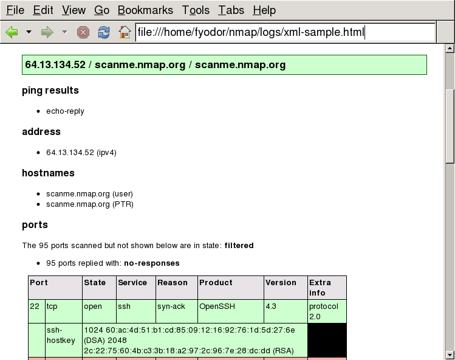

Blocked for possible web abuse

Blocked for possible web abuse
==========

The IP address you are coming from has requested an inordinately large number of pages in a short amount of time and has been temporarily blocked to conserve our resources. This often happens when people try to use web spidering programs to download large portions of the site. The block will be removed 24 hours after the latest period of high traffic. If you feel this IP ban was made in error, you can email fyodor@nmap.org.

* [Nmap Network Scanning](https://nmap.org/book/toc.html)
* [Chapter 13. Nmap Output Formats](https://nmap.org/book/output.html)
* Creating HTML Reports

[Prev](https://nmap.org/book/output-formats-output-to-database.html)

[Next](https://nmap.org/book/output-formats-grepable-output.html)

Creating HTML Reports
----------

[]()[]()

Nmap does not have an option for saving scan results in HTML,
however it is possible to convert XML output to HTML automatically. An
Nmap XML output file usually contains a reference to an[XSL](http://www.w3.org/Style/XSL/)[]()stylesheet called`nmap.xsl`[]()that describes how the transformation takes place.

The XML processing instruction that says where the stylesheet can
be found will look something like

```
<?xml-stylesheet href="/usr/share/nmap/nmap.xsl" type="text/xsl"?>

```

The exact location may be different depending on the platform and how
Nmap was configured.

Such a stylesheet reference will work fine when viewing scan
results on the same machine that initiated the scan, but it will not
work if the XML file is transferred to another machine where the`nmap.xsl` file is in a different place or absent
entirely. To make the XML styling portable, give the[]()`--webxml`option to Nmap. This will change the processing instruction to read

```
<?xml-stylesheet href="https://nmap.org/svn/docs/nmap.xsl" type="text/xsl"?>

```

The resultant XML output file will render as HTML on any web-connected
machine. Using the network location in this fashion is often more
useful, but the local copy of `nmap.xsl` is used by
default for privacy reasons.

To use a different stylesheet, use the[]()`--stylesheet *`<file>`*`option. Note that `--webxml` is an alias for`--stylesheet https://nmap.org/svn/docs/nmap.xsl`.
To omit the stylesheet entirely, use the option[]()`--no-stylesheet`.

### Saving a Permanent HTML Report ###

[]()

Here are commands that turn an Nmap XML output file into an HTML
file using common XSLT processors. Sample output viewed in a web browser
is shown in [Figure 13.1, “HTML from XML output in a web browser”](https://nmap.org/book/output-formats-output-to-html.html#output-formats-fig-xml-browser).

[]()[xsltproc](http://xmlsoft.org/XSLT/)

**xsltproc *`<nmap-output.xml>`* -o *`<nmap-output.html>`***

[]()[Saxon](http://saxon.sourceforge.net/)

Saxon 9: **java -jar saxon9.jar -s:*`<nmap-output.xml>`* -o:*`<nmap-output.html>`***

Previous Saxon releases: **java -jar saxon.jar -a *`<nmap-output.xml>`* -o *`<nmap-output.html>`***

[]()[Xalan](http://xalan.apache.org/)

Using Xalan C++: **Xalan -a *`<nmap-output.xml>`* -o *`<nmap-output.html>`***

Using Xalan Java: **java -jar xalan.jar -IN *`<nmap-output.xml>`* -OUT *`<nmap-output.html>`***

Figure 13.1. HTML from XML output in a web browser



These programs automatically know where to load the stylesheet thanks to
the embedded stylesheet reference. As a historical note, the stylesheet
was originally intended to render the XML output as HTML by simply
opening the XML file in a web browser. For a while it worked that way.
But web browsers are implementing more and more severe
same-origin restrictions[]()that prevent XML files from loading except from narrowly limited
locations. For example, Gecko, the rendering engine used by Mozilla,
requires that the stylesheet be located in the same directory as or in a
subdirectory of the XML file.

[]()

---

[Prev](https://nmap.org/book/output-formats-output-to-database.html)Output to a Database

[Up](https://nmap.org/book/output.html)Chapter 13. Nmap Output Formats

[Home](https://nmap.org/book/toc.html)

[Next](https://nmap.org/book/output-formats-grepable-output.html)Grepable Output (-oG)