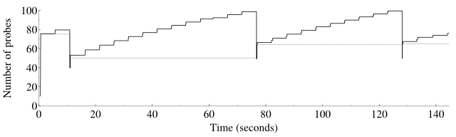
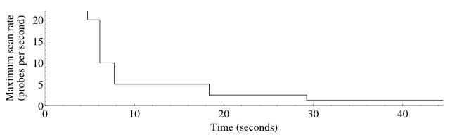

Blocked for possible web abuse

Blocked for possible web abuse
==========

The IP address you are coming from has requested an inordinately large number of pages in a short amount of time and has been temporarily blocked to conserve our resources. This often happens when people try to use web spidering programs to download large portions of the site. The block will be removed 24 hours after the latest period of high traffic. If you feel this IP ban was made in error, you can email fyodor@nmap.org.

* [Nmap Network Scanning](https://nmap.org/book/toc.html)
* [Chapter 5. Port Scanning Techniques and Algorithms](https://nmap.org/book/scan-methods.html)
* Scan Code and Algorithms

[Prev](https://nmap.org/book/scan-methods-ftp-bounce-scan.html)

[Next](https://nmap.org/book/performance.html)

Scan Code and Algorithms
----------

In 2004, Nmap's primary port scanning engine was rewritten for
greater performance and accuracy. The new engine, known as`ultra_scan`after its function name, handles SYN, connect, UDP, NULL, FIN, Xmas,
ACK, window, Maimon, and IP protocol scans, as well as the various host
discovery scans. That leaves only idle scan and FTP bounce scan using
their own engines.

While the diagrams throughout this chapter show how each scan
type works, the Nmap implementation is far more complex since it has
to worry about port and host parallelization, latency estimation,
packet loss detection, timing profiles, abnormal network conditions,
packet filters, response rate limits, and much more.

This section doesn't provide every low-level detail of the`ultra_scan` engine. If you are inquisitive enough
to want that, you are better off getting it from the source. You can
find `ultra_scan` and its high-level helper
functions defined in `scan_engine.cc` from the Nmap
tarball. Here I cover the most important algorithmic features.
Understanding these helps in optimizing your scans for better
performance, as described in [Chapter 6, *Optimizing Nmap Performance*](https://nmap.org/book/performance.html).

### Network Condition Monitoring ###

Some authors brag that their scanners are faster than Nmap
because of
stateless operation.They simply blast out a flood of packets
then listen for responses and hope for the best. While this may have
value for quick surveys and other cases where speed is more important
than comprehensiveness and accuracy, I don't find it appropriate for
security scanning. A stateless scanner cannot detect dropped packets
in order to retransmit and throttle its send rate. If a busy router
half way along the network path drops 80% of the scanner's packet
flood, the scanner will still consider the run successful and print
results that are woefully inaccurate. Nmap, on the other hand, saves
extensive state in RAM while it runs. There is usually plenty of
memory available, even on a PDA. Nmap marks each probe with sequence
numbers, source or destination ports, ID fields, or other aspects
(depending on probe type) which allow it to recognize responses (and
thus drops). It then adjusts its speed appropriately to stay as fast
as the network (and given command-line options) allow without crossing
the line and suffering inaccuracy or unfairly hogging a shared
network. Some administrators who have not installed an IDS might not
notice an Nmap SYN scan of their whole network. But you better
believe the administrator will investigate if you use a brute packet flooding
scanner that affects his Quake ping time!

While
Nmap's congestion control algorithms are recommended for most scans,
they can be overridden. The `--min-rate` option sends
packets at the rate you specify (or higher) even if that exceeds
Nmap's normal congestion control limits. Similarly,
the `--max-retries` option controls how many times Nmap
may retransmit a packet. Options such as `--min-rate
100 --max-retries 0` will emulate the behavior of simple
stateless scanners. You could double that speed by specifying a rate
of 200 packets per second rather than 100, but don't get too
greedy—an extremely fast scan is of little value if the results
are wrong or incomplete. Any use of `--min-rate` is at
your own risk.

### Host and Port Parallelization ###

Most of the diagrams in this chapter illustrate the use of a
technique to determine the state of a single port. Sending a probe
and receiving the response takes at least one round trip time (RTT) between
the source and target machines. If your RTT is 200 ms and you are
scanning 65,536 ports on a machine, handling them serially would take
at least 3.6 hours. Scan a network of 20,000 machines that way and
the wait balloons to more than eight years. This is clearly
unacceptable so Nmap parallelizes its scans and is capable of
scanning hundreds of ports on each of dozens of machines at the same
time. This improves speeds by several orders of magnitude. The
number of hosts and ports it scans at a time is dependent on arguments
described in [Chapter 6, *Optimizing Nmap Performance*](https://nmap.org/book/performance.html), including`--min-hostgroup`, `--min-parallelism`,`-T4`, `--max-rtt-timeout`, and many
others. It also depends on network conditions detected by
Nmap.

When scanning multiple machines, Nmap tries to efficiently
spread the load between them. If a machine appears overwhelmed (drops
packets or its latency increases), Nmap slows down for that host while
continuing against others at full speed.

### Round Trip Time Estimation ###

Every time a probe response is received, Nmap calculates the
microseconds elapsed since the probe was sent. We'll call this the
instanceRTT, and Nmap uses it to keep a running tally of three crucial
timing-related values: `srtt`, `rttvar`, and `timeout`. Nmap keeps separate
values for each host and also merged values for a whole group of hosts
scanned in parallel. They are calculated as follows:

`srtt`

The smoothed average round trip time. This is what Nmap uses as its most accurate RTT guess. Rather than use a true arithmetic mean, the formula favors more recent results because network conditions change frequently. The formula is:

`newsrtt = oldsrtt + (instanceRTT - oldsrtt) / 8`

`rttvar`

This is the observed variance or deviation in the round trip time. The idea is that if RTT values are quite consistent, Nmap can give up shortly after waiting the `srtt`. If the variance is quite high, Nmap must wait much longer than the `srtt` before giving up on a probe because relatively slow responses are common. The formula follows (ABS represents the absolute value operation):

`newrttvar = oldrttvar + (ABS(instanceRTT - oldsrtt) - oldrttvar) / 4`

`timeout`

This is the amount of time Nmap is willing to wait before giving up on a probe. It is calculated as:

`timeout = newsrtt + newrttvar * 4`

When a probe times out, Nmap may retransmit the probe or
assign a port state such as `filtered` (depending on
scan type). Nmap keeps some state information even after a timeout
just in case a late response arrives while the overall scan is still
in progress.

These simple time estimation formulas seem to work quite well.
They are loosely based on similar techniques used by TCP and
discussed in [RFC
2988, *Computing TCP's Retransmission Timer*](http://www.rfc-editor.org/rfc/rfc2988.txt). We have optimized those algorithms over the years to better suit port scanning.

### Congestion Control ###

Retransmission timers are far from the only technique Nmap
gleaned from TCP. Since Nmap is most commonly used with TCP, it is
only fair to follow many of the same rules. Particularly since those
rules are the result of substantial research into maximizing
throughput without degrading into a tragedy of the commons where
everyone selfishly hogs the network. With its default options, Nmap
is reasonably polite. Nmap uses three algorithms modeled after TCP to
control how aggressive the scan is: a congestion window, exponential backoff, and slow start. The
congestion window controls how many probes Nmap may have outstanding
at once. If the window is full, Nmap won't send any more until a
response is received or a probe times out.
Exponential backoff causes Nmap to slow down dramatically
when it detects dropped packets. The congestion window is usually
reduced to one whenever drops are detected. Despite slow being in the name, slow start is a rather quick algorithm
for gradually increasing the scan speed to determine the performance
limits of the network.

All of these techniques are described in [RFC 2581, *TCP
Congestion Control*](http://www.rfc-editor.org/rfc/rfc2581.txt). That document was written by networking
gurus Richard Stevens, Vern Paxson, and Mark Allman. It is only 10
pages long and anyone interested in implementing efficient TCP stacks
(or other network protocols, or port scanners) should find it
fascinating.

When Nmap scans a group of targets, it maintains in memory a
congestion window and threshold for each target, as well as a window and
threshold for the group as a whole. The congestion window is the number
of probes that may be sent at one time. The congestion threshold defines
the boundary between slow start and congestion avoidance modes. During
slow start, the congestion window grows rapidly in response to
responses. Once the congestion window exceeds the congestion threshold,
congestion avoidance mode begins, during which the congestion window
increases more slowly. After a drop, both the congestion window and
threshold are reduced to some fraction of their previous value.

There is an important difference between TCP streams and Nmap
port scans, however. In TCP streams, it's normal to expect ACKs in
response to every packet sent (or at least a large fraction of them). In
fact, proper growth of the congestion window depends on this assumption.
Nmap often finds itself in a different situation: facing a target with
a
default-denyfirewall, very few sent packets will ever be responded
to. The same thing happens when ping scanning a block of network
addresses that contains only a few live hosts. To compensate for this,
Nmap keeps track of the ratio of packets sent to responses received. Any
time the group congestion window changes, the amount of the change is
multiplied by this ratio. In other words, when few packets receive
responses, each response carries more weight.

A graphical description of how the group congestion window and
threshold vary during a typical port scan is shown in[Figure 5.9](https://nmap.org/book/port-scanning-algorithms.html#scan-methods-fig-cc-graph). The congestion window is
shown in black and the congestion threshold is in gray.

Figure 5.9. Congestion window and threshold

The congestion window starts low and the congestion threshold
starts high. Slow start mode begins and the window size increases
rapidly. The large “stairstep” jumps are the result of
timing pings. At about 10 seconds, the congestion window has grown to 80
probes when a drop is detected. Both the congestion window and threshold
are reduced. The congestion window continues to grow until about 80
seconds when another drop is detected. Then the cycle repeats, which is
typical when network conditions are stable.

Drops during a scan are nothing to be afraid of. The purpose of
the congestion control algorithms is to dynamically probe the network to
discover its capacity. Viewed in this way, drops are valuable feedback
that help Nmap determine the correct size for the congestion
window.

### Timing probes ###

Every technique discussed in this algorithms section involves
(at some level) network monitoring to detect and estimate network
packet loss and
latency.This really is critical to obtaining fast
scan times. Unfortunately, good data is often difficult to come by
when scanning heavily firewalled systems. These filters often drop
the overwhelming majority of packets without any response. Nmap may
have to send 20,000 probes or more to find one responsive port, making
it difficult to monitor network conditions.

To combat this problem, Nmap uses timing probes, also known as port
scan pings. If Nmap has found at least one port responsive on a
heavily filtered host, it will send a probe to that port every 1.25
seconds that it goes without receiving responses from any other ports.
This allows Nmap to conduct a sufficient level of monitoring to speed
up or slow down its scans as network conditions allow.

### Inferred Neighbor Times ###

Sometimes even port scan pings won't help because no responsive
ports at all have been found. The machine could be down (and scanned
with `-Pn`), or every single port could be filtered.
Or perhaps the target does have a couple responsive ports, but Nmap has not been
lucky enough to find them yet. In these cases, Nmap uses timing
values that it maintains for the whole group of machines it is
scanning at the same time. As long as at least one response has been
received from any machine in the group, Nmap has something to work
with. Of course Nmap cannot assume that hosts in a group always share
similar timing characteristics. So Nmap tracks the timing variances
between responsive hosts in a group. If they differ wildly, Nmap
infers long timeouts for neighboring hosts to be on the safe side.

### Adaptive Retransmission ###

The simplest of scanners (and the
stateless ones)generally
don't retransmit probes at all. They simply send a probe to each port
and report based on the response or lack thereof. Slightly more
complex scanners will retransmit a set number of times. Nmap tries to
be smarter by keeping careful packet loss statistics for each scan
against a target.If no packet loss is detected, Nmap may retransmit
only once when it fails to receive a probe response. When massive
packet loss is evident, Nmap may retransmit ten or more times. This
allows Nmap to scan hosts on fast, reliable networks quickly, while
preserving accuracy (at the expense of some speed) when scanning
problematic networks or machines. Even
Nmap's patience isn't unlimited though. At a certain point (ten
retransmissions), Nmap will print a warning and give up
on further retransmissions. This prevents malicious hosts from
slowing Nmap down too much with intentional packet drops, slow
responses, and similar shenanigans. That technique is known as
tarpittingand is commonly used against spammers.

### Scan Delay ###

Packet response rate limiting is perhaps the most pernicious
problem faced by port scanners such as Nmap. For example, Linux 2.4
kernels limitICMP error messages returned during a UDP
(`-sU`) or IP protocol (`-sO`) scan to
one per second. If Nmap counted these as normal drops, it would be
continually slowing down (remember exponential backoff) but still end
up having the vast majority of its probes dropped. Instead, Nmap
tries to detect this situation.When a large proportion of packets
are being dropped, it implements a short delay (as little as 5
milliseconds) between each probe sent to a single target. If drops
continue to be a major problem, Nmap will keep doubling the delay
until the drops cease or Nmap hits the maximum allowed scan
delay. The effects of scan delay while UDP scanning ports 1–50 of
a response rate-limited Linux host are shown in[Figure 5.10](https://nmap.org/book/port-scanning-algorithms.html#scan-methods-fig-scan-delay). At the beginning, the
scan rate is unlimited by scan delay, though of course other mechanisms
such as congestion control impose their own limits. When drops are
detected, the scan delay is doubled, meaning that the maximum scan rate
is effectively halved. In the graph, for example, a maximum scan rate
of five packets per second corresponds to a scan delay of 200
milliseconds.

Figure 5.10. Scan rate as affected by scan delay

The maximum scan delay defaults to one second between probes. The
scan delay is sometimes enabled when a slow host can't keep up, even
when that host has no explicit rate limiting rules. This can reduce
total network traffic substantially by reducing wasted (dropped) probe
packets. Unfortunately even small scan delay values can make a scan
takes several times as long. Nmap is conservative by default,
allowing second-long scan delays for TCP and UDP probes. If your
priorities differ, you can configure maximum scan delays with `--max-scan-delay` as discussed
in [Chapter 5, *Port Scanning Techniques and Algorithms*](https://nmap.org/book/scan-methods.html).

---

[Prev](https://nmap.org/book/scan-methods-ftp-bounce-scan.html)TCP FTP Bounce Scan (-b)

[Up](https://nmap.org/book/scan-methods.html)Chapter 5. Port Scanning Techniques and Algorithms

[Home](https://nmap.org/book/toc.html)

[Next](https://nmap.org/book/performance.html)Chapter 6. Optimizing Nmap Performance