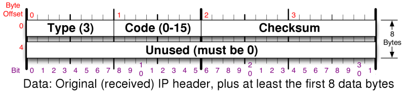

[Download](https://nmap.org/download.html)[Reference Guide](https://nmap.org/book/man.html)[Book](https://nmap.org/book/)[Docs](https://nmap.org/docs.html)[Zenmap GUI](https://nmap.org/zenmap/)[In the Movies](https://nmap.org/movies/)

* [Nmap Network Scanning](https://nmap.org/book/toc.html)
* Chapter 5. Port Scanning Techniques and Algorithms

[Prev](https://nmap.org/book/solution-find-open-port.html)

[Next](https://nmap.org/book/synscan.html)

Chapter 5. Port Scanning Techniques and Algorithms
==========

Table of Contents

* [Introduction](https://nmap.org/book/scan-methods.html#scan-methods-intro)
* [TCP SYN (Stealth) Scan (`-sS`)](https://nmap.org/book/synscan.html)
* [TCP Connect Scan (`-sT`)](https://nmap.org/book/scan-methods-connect-scan.html)
* [UDP Scan (`-sU`)](https://nmap.org/book/scan-methods-udp-scan.html)
  * [Distinguishing Open from Filtered UDP Ports](https://nmap.org/book/scan-methods-udp-scan.html#scan-methods-disambiguate)
  * [Speeding Up UDP Scans](https://nmap.org/book/scan-methods-udp-scan.html#scan-methods-udp-optimizing)

* [TCP FIN, NULL, and Xmas Scans (`-sF`, `-sN`, `-sX`)](https://nmap.org/book/scan-methods-null-fin-xmas-scan.html)
* [Custom Scan Types with `--scanflags`](https://nmap.org/book/scan-methods-custom-scanflags.html)
  * [Custom SYN/FIN Scan](https://nmap.org/book/scan-methods-custom-scanflags.html#scan-methods-custom-synfin)
  * [PSH Scan](https://nmap.org/book/scan-methods-custom-scanflags.html#scan-methods-custom-psh)

* [TCP ACK Scan (`-sA`)](https://nmap.org/book/scan-methods-ack-scan.html)
* [TCP Window Scan (`-sW`)](https://nmap.org/book/scan-methods-window-scan.html)
* [TCP Maimon Scan (`-sM`)](https://nmap.org/book/scan-methods-maimon-scan.html)
* [TCP Idle Scan (`-sI`)](https://nmap.org/book/idlescan.html)
  * [Idle Scan Step by Step](https://nmap.org/book/idlescan.html#scan-methods-idle-scan-steps)
  * [Finding a Working Idle Scan Zombie Host](https://nmap.org/book/idlescan.html#scan-methods-idle-scan-finding-zombies)
  * [Executing an Idle Scan](https://nmap.org/book/idlescan.html#scan-methods-idle-scan-execution)
  * [Idle Scan Implementation Algorithms](https://nmap.org/book/idlescan.html#scan-methods-idle-scan-algorithms)

* [IP Protocol Scan (`-sO`)](https://nmap.org/book/scan-methods-ip-protocol-scan.html)
* [TCP FTP Bounce Scan (`-b`)](https://nmap.org/book/scan-methods-ftp-bounce-scan.html)
* [Scan Code and Algorithms](https://nmap.org/book/port-scanning-algorithms.html)
  * [Network Condition Monitoring](https://nmap.org/book/port-scanning-algorithms.html#scan-methods-net-conditions)
  * [Host and Port Parallelization](https://nmap.org/book/port-scanning-algorithms.html#scan-methods-para)
  * [Round Trip Time Estimation](https://nmap.org/book/port-scanning-algorithms.html#scan-methods-rtt)
  * [Congestion Control](https://nmap.org/book/port-scanning-algorithms.html#scan-methods-congestion)
  * [Timing probes](https://nmap.org/book/port-scanning-algorithms.html#scan-methods-timing-probes)
  * [Inferred Neighbor Times](https://nmap.org/book/port-scanning-algorithms.html#scan-methods-neighbor)
  * [Adaptive Retransmission](https://nmap.org/book/port-scanning-algorithms.html#scan-methods-adaptive-retransmission)
  * [Scan Delay](https://nmap.org/book/port-scanning-algorithms.html#scan-methods-delay)

Introduction
----------

As a novice performing automotive repair, I can struggle
for hours trying to fit my rudimentary tools (hammer, duct tape,
wrench, etc.) to the task at hand. When I fail miserably and tow my
jalopy to a real mechanic, he invariably fishes around in a huge tool chest until
pulling out the perfect gizmo which makes the job seem effortless. The
art of port scanning is similar. Experts understand the dozens of
scan techniques and choose the appropriate one (or combination) for a
given task. Inexperienced users and script kiddies, on the other
hand, try to solve every problem with the default SYN scan. Since Nmap is
free, the only barrier to port scanning mastery is knowledge. That
certainly beats the automotive world, where it may take great skill to
determine that you need a strut spring compressor, then you still
have to pay thousands of dollars for it.

The previous chapter described port scanning with Nmap in
general terms, including a brief summary of Nmap's supported scan
types in [the section called “Selecting Scan Techniques”](https://nmap.org/book/port-scanning-options.html#port-scanning-options-scantypes). This
chapter describes each of those scan types in depth. Typical usage
scenarios and instructions are given for each scan type, as are
on-the-wire packet traces illustrating how they work. Then the`ultra_scan` algorithm (which most scan methods use)
is discussed, with an emphasis on aspects that can be tweaked to
improve performance.

Most of the scan types are only available to privileged users.
This is because they send and receive
raw IP packets, (or even ethernet frames) which requires
root accesson Unix systems. Using an administrator account on Windows is
not necessary, since Nmap works for unprivileged users on
that platform when Npcap has already been
loaded into the OS. Requiring root privileges was a serious
limitation when Nmap was released in 1997, as many users only had
access to shared shell accounts. Now, the world is different.
Computers are cheaper, far more people have always-on direct Internet
access, and desktop Unix systems (including Linux and Mac OS X) are
prevalent. A Windows version of Nmap is now available, allowing it to
run on even more desktops. For all these reasons, users rarely
need to run Nmap from limited shared shell accounts. This is
fortunate, as the privileged options make Nmap far more powerful and
flexible.

When discussing how Nmap handles probe responses, many sections
discuss ICMP error messages by their type and code numbers. The type
and code are each eight-bit fields in ICMP headers that describe the
message's purpose. Nmap port scanning techniques are concerned only
with ICMP type 3, which are destination unreachable messages. [Figure 5.1](https://nmap.org/book/scan-methods.html#scan-methods-fig-icmp-unreachable-header) shows the ICMP
header layout of such a packet (it is encapsulated in the data section
of an IP packet, as shown in [Figure 1, “IPv4 header”](https://nmap.org/book/tcpip-ref.html#ipv4-header)).

Figure 5.1. ICMPv4 destination unreachable header layout

There are sixteen codes representing different destination
unreachable messages. They are all shown in [Table 5.1](https://nmap.org/book/scan-methods.html#scan-methods-tbl-icmp-unreachable-codes), though Nmap only
cares about codes 0–3, 9, 10, and 13, which are marked with an asterisk.

Table 5.1. ICMP destination unreachable (type 3) code values

|Code|                     Description                      |
|----|------------------------------------------------------|
|0\* |                 Network unreachable                  |
|1\* |                   Host unreachable                   |
|2\* |                 Protocol unreachable                 |
|3\* |                   Port unreachable                   |
| 4  |   Fragmentation needed but don't-fragment bit set    |
| 5  |                 Source route failed                  |
| 6  |             Destination network unknown              |
| 7  |               Destination host unknown               |
| 8  |           Source host isolated (obsolete)            |
|9\* |   Destination network administratively prohibited    |
|10\*|     Destination host administratively prohibited     |
| 11 |    Network unreachable for type of service (TOS)     |
| 12 |               Host unreachable for TOS               |
|13\*|Communication administratively prohibited by filtering|
| 14 |              Host precedence violation               |
| 15 |             Precedence cutoff in effect              |

---

[Prev](https://nmap.org/book/solution-find-open-port.html)SOLUTION: Scan a Large Network for a Certain Open TCP Port

[Up](https://nmap.org/book/toc.html)Nmap Network Scanning

[Home](https://nmap.org/book/toc.html)

[Next](https://nmap.org/book/synscan.html)TCP SYN (Stealth) Scan (-sS)