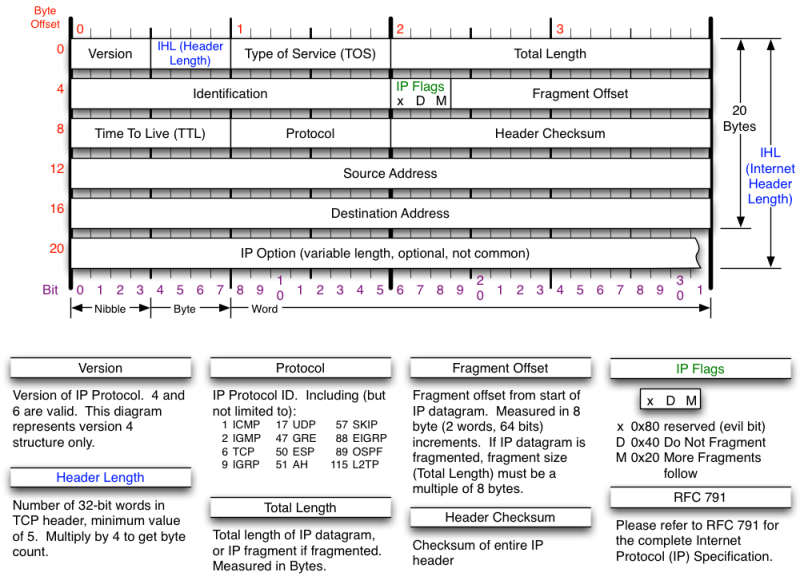
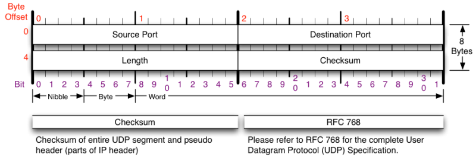

[Download](https://nmap.org/download.html)[Reference Guide](https://nmap.org/book/man.html)[Book](https://nmap.org/book/)[Docs](https://nmap.org/docs.html)[Zenmap GUI](https://nmap.org/zenmap/)[In the Movies](https://nmap.org/movies/)

* [Nmap Network Scanning](https://nmap.org/book/toc.html)
* [Preface](https://nmap.org/book/preface.html)
* TCP/IP Reference

[Prev](https://nmap.org/book/acknowledgements.html)

[Next](https://nmap.org/book/intro.html)

TCP/IP Reference
----------

This book assumes basic familiarity with TCP/IP and
networking concepts. You won't find a primer on the OSI seven-layer model
or a rundown of the Berkeley Socket API within these pages. For a
comprehensive guide to TCP/IP, I
recommend “[*The
TCP/IP Guide*](http://www.amazon.com/dp/159327047X?tag=secbks-20)” by Charles Kozierok or the old
classic “[*TCP/IP
Illustrated, Volume I*](http://www.amazon.com/dp/0201633469?tag=secbks-20)” by W. Richard Stevens.

While TCP/IP familiarity is expected, even the best of us
occasionally forget byte offsets for packet header fields and flags.
This section provides quick reference diagrams and field descriptions
for the IPv4, TCP, UDP, and ICMP protocols. These beautiful diagrams
are used by permission of author Matt Baxter.

Figure 1. IPv4 header

Figure 2. TCP header

Figure 3. UDP header

Figure 4. ICMP header

---

[Prev](https://nmap.org/book/acknowledgements.html)Acknowledgements

[Up](https://nmap.org/book/preface.html)Preface

[Home](https://nmap.org/book/toc.html)

[Next](https://nmap.org/book/intro.html)Chapter 1. Getting Started with Nmap