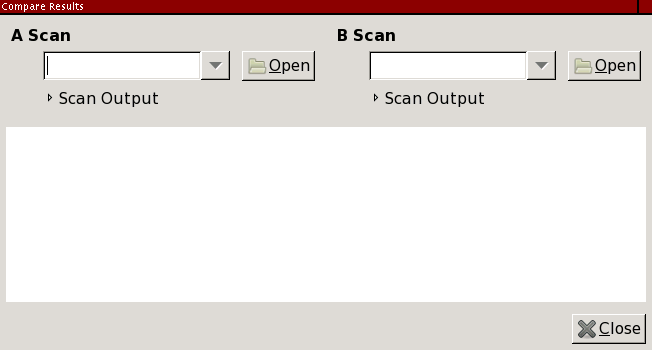
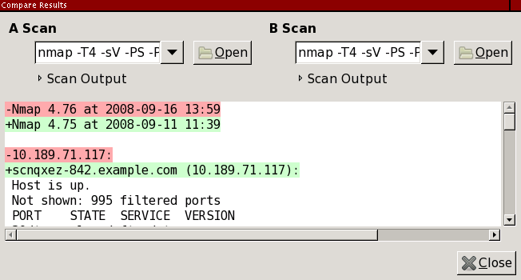

Blocked for possible web abuse

Blocked for possible web abuse
==========

The IP address you are coming from has requested an inordinately large number of pages in a short amount of time and has been temporarily blocked to conserve our resources. This often happens when people try to use web spidering programs to download large portions of the site. The block will be removed 24 hours after the latest period of high traffic. If you feel this IP ban was made in error, you can email fyodor@nmap.org.

* [Nmap Network Scanning](https://nmap.org/book/toc.html)
* [Chapter 12. Zenmap GUI Users' Guide](https://nmap.org/book/zenmap.html)
* Comparing Results

[Prev](https://nmap.org/book/zenmap-search.html)

[Next](https://nmap.org/book/zenmap-lang.html)

Comparing Results
----------

 It is a common desire to run the same scan twice at different times, or run two slightly different scans at the same time, and see how they differ. Zenmap provides an interface for comparing scan results, shown in [Figure 12.16](https://nmap.org/book/zenmap-compare.html#zenmap-fig-compare). Open the comparison tool by selecting “Compare Results” from the “Tools” menu or by using the **ctrl**+**D** (think “diff”) keyboard shortcut. Zenmap supports comparing two scan results at a time.

Figure 12.16. Comparison tool

 The first step in performing a comparison is selecting two scans to compare, which are called the “A scan” and the “B scan”. The combo boxes allow you to choose from open scans. Or click the “Open” buttons to get scan results from a file. To compare results from the recent scans database, you must first open those scans using the search interface (see [the section called “Searching Saved Results”](https://nmap.org/book/zenmap-search.html)).

 The order of the two scans matters. Comparison is always done “from” the A scan “to” the B scan, regardless of the times recorded in the files. Once the two results have been chosen the comparison begins immediately. [Figure 12.17](https://nmap.org/book/zenmap-compare.html#zenmap-fig-compare-example) shows a comparison between two scans of several Internet hosts, run a few days apart.

Figure 12.17. Comparison output

 The diff output resembles Nmap's output. Each line is preceded by ‘` `’, ‘`-`’, or ‘`+`’, indicating that some piece of information was unchanged, removed, or added respectively. Color coding also indicates differences; red for deletion and green for addition.

 The engine underlying Zenmap's comparison function is Ndiff, a non-graphical tool distributed with Nmap. Ndiff runs on any platform that Zenmap runs on. If you have installed the `ndiff` executable somewhere other than its default location, you may have to modify the `nmap_command_path` variable in the `[paths]` section of `zenmap.conf` to point to it.

---

[Prev](https://nmap.org/book/zenmap-search.html)Searching Saved Results

[Up](https://nmap.org/book/zenmap.html)Chapter 12. Zenmap GUI Users' Guide

[Home](https://nmap.org/book/toc.html)

[Next](https://nmap.org/book/zenmap-lang.html)Zenmap in Your Language