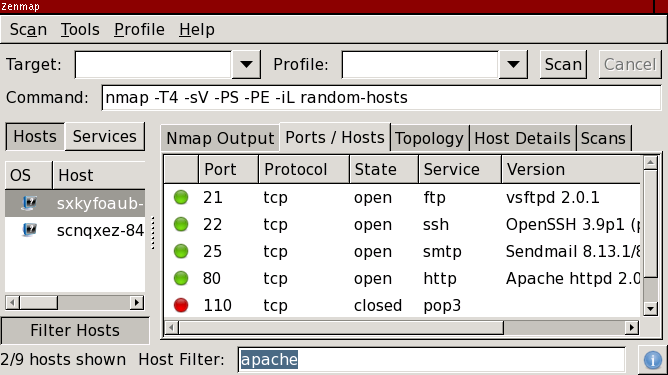

Blocked for possible web abuse

Blocked for possible web abuse
==========

The IP address you are coming from has requested an inordinately large number of pages in a short amount of time and has been temporarily blocked to conserve our resources. This often happens when people try to use web spidering programs to download large portions of the site. The block will be removed 24 hours after the latest period of high traffic. If you feel this IP ban was made in error, you can email fyodor@nmap.org.

* [Nmap Network Scanning](https://nmap.org/book/toc.html)
* [Chapter 12. Zenmap GUI Users' Guide](https://nmap.org/book/zenmap.html)
* Host Filtering

[Prev](https://nmap.org/book/zenmap-profile-editor.html)

[Next](https://nmap.org/book/zenmap-search.html)

Host Filtering
----------

 The list of hosts can be filtered by a filter string. When the filter is active, only the hosts matching the filter string will be shown. The other hosts are still present in the inventory, but hidden. Using a filter string, you can quickly narrow down a large scan to just the hosts you are interested in. [Figure 12.12](https://nmap.org/book/zenmap-filter.html#zenmap-fig-filter) shows the host filter in action, finding the two hosts out of nine that match **`apache`**.

Figure 12.12. Host filter

 The host filter is activated by clicking the “Filter Hosts” button, selecting “Filter Hosts” from the “Tools” menu, or pressing **ctrl**+**L**. This will raise the filter bar at the bottom of the screen. Hosts are filtered live as you type. To disable the filter, click “Filter Hosts” or press **ctrl**+**L** again to hide the filter bar.

 This simplest form of host filtering is basic keyword matching. Enter one or more strings such as **`apache`**, **`linux`**, or **`telnet`**, and it will match hosts that have the string anywhere in their information—as a hostname or IP address, port name or number, OS match, or service version string. If more than one word is in the filter string, all the words must match for a host to be shown.

 For more specific results, the host filter also supports matching only specific data fields in each host. The syntax supported is a subset of the search criteria discussed in detail in [the section called “Searching Saved Results”](https://nmap.org/book/zenmap-search.html). The criteria allowed in the host filter are

|                                          keyword matching;                                           |
|------------------------------------------------------------------------------------------------------|
|port states: `open:`, `closed:`, `filtered:`, `open|filtered:`, `closed|filtered:`, and `unfiltered:`;|
|                                      `os:` (operating system);                                       |
|                                  `service:` (service version); and                                   |
|                                     `inroute:` (host in route).                                      |

 Here are some examples of host filter strings.

**apache**

This keyword search matches hosts that have been found to be running the Apache web server, but will also match any other host with “apache” in it, for example one named `apache.example.com`.

**service:apache**

This is like the previous string, but it will only match “apache” in a service version.

**os:linux ssh**

Shows Linux hosts that are running SSH.

**open:445**

Shows all hosts with port 445 open.

---

[Prev](https://nmap.org/book/zenmap-profile-editor.html)The Profile Editor

[Up](https://nmap.org/book/zenmap.html)Chapter 12. Zenmap GUI Users' Guide

[Home](https://nmap.org/book/toc.html)

[Next](https://nmap.org/book/zenmap-search.html)Searching Saved Results