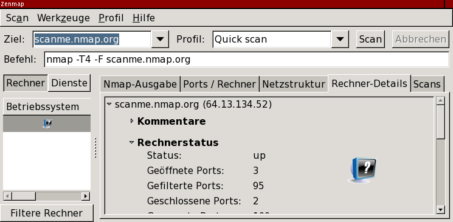
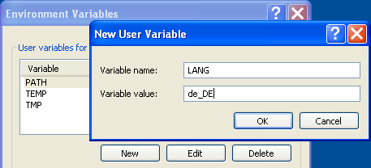
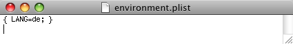

Blocked for possible web abuse

Blocked for possible web abuse
==========

The IP address you are coming from has requested an inordinately large number of pages in a short amount of time and has been temporarily blocked to conserve our resources. This often happens when people try to use web spidering programs to download large portions of the site. The block will be removed 24 hours after the latest period of high traffic. If you feel this IP ban was made in error, you can email fyodor@nmap.org.

* [Nmap Network Scanning](https://nmap.org/book/toc.html)
* [Chapter 12. Zenmap GUI Users' Guide](https://nmap.org/book/zenmap.html)
* Zenmap in Your Language

[Prev](https://nmap.org/book/zenmap-compare.html)

[Next](https://nmap.org/book/zenmap-files.html)

Zenmap in Your Language
----------

[]()[]()[]()

 Zenmap has been translated into a few languages other than English. [Figure 12.18](https://nmap.org/book/zenmap-lang.html#zenmap-fig-lang) shows what Zenmap looks like in German. This section shows how to use Zenmap's translations.

Figure 12.18. Zenmap in German



[]()

 On Unix-like systems, you select your preferred language by setting the `LANG` environment variable. Even on other operating systems with different language selection facilities, setting `LANG` is the most foolproof way to get translations when other methods don't work. Your Unix-like operating system may set `LANG` as a side effect of its language configuration. If it does not, add a line like the following to your `.login`[]() or `.profile`[](), replacing `de` with your locale name:

```
export LANG=de

```

[]()[]()[]()

 A locale name is a language code optionally followed by a country code and sometimes other information. Language codes are from [ISO 639](http://www.loc.gov/standards/iso639-2/)[]() and country codes are from [ISO 3166](http://www.iso.org/iso/country_codes.htm)[](). Here “de” means German; another example is “pt\_BR” for Brazilian Portuguese. To disable localization entirely and use the default English text, set `LANG=C`.

 To set `LANG` on Windows XP, follow these steps. Open the Control Panel and choose the “System” item. Click the “Advanced” tab and then the “Environment Variables” button. A new display will open up; under “User variables” click “New”. In the form that appears enter “LANG” for the variable name and your locale name for the value. The process is illustrated in [Figure 12.19](https://nmap.org/book/zenmap-lang.html#zenmap-fig-lang-win).

Figure 12.19. Setting the `LANG` environment variable on Windows XP



 On Mac OS X, setting `LANG` in a shell startup file as described above has an effect only when Zenmap is started from a terminal. The graphical Finder interface keeps its environment variables in a separate file, `.MacOSX/environment.plist`[](). To create it, open the TextEdit application and enter the following, replacing `de` with your locale name:

```
{ LANG=de; }

```

 Then from the “Format” menu choose “Make Plain Text”. Open the “Save” dialog, select your home directory and click “New Folder”. Create a folder called `.MacOSX` and click past the warning that appears. Save the file with the name `environment.plist`, and insist on the extension `.plist` in the next warning that appears. Finally, log out and back in to make the change take effect. A portion of this process is shown in [Figure 12.20](https://nmap.org/book/zenmap-lang.html#zenmap-fig-lang-mac).

Figure 12.20. Setting the `LANG` environment variable on Mac OS X



### Creating a new translation ###

 Creating a new translation for Zenmap, or updating an existing one, is not hard technically, though of course it requires some know-how and knowledge of at least one language other than English. Zenmap's translations are handled by the GNU gettext[]() system, which is documented fully at [`http://www.gnu.org/software/gettext/manual/`](http://www.gnu.org/software/gettext/manual/). This section is a summary of the manual translation process. There also exist specialized translation editing programs that do these steps automatically.

 Let's say you are going to make a translation into Spanish, which has the language code “es”. Within the Zenmap source tree there is a plain-text file `share/zenmap/locale/zenmap.pot` containing all the translatable strings in the application. You create a new *portable object* (`.po`) file by running **msginit -l es.po -i zenmap.pot**. The new `es.po` file contains all the application's English strings followed by blank strings where you fill in the appropriate translations.

 To test the portable object file you must turn it into a *machine object* (`.mo`) file. Create the directory `es/LC_MESSAGES` and then run **msgfmt es.po -o es/LC\_MESSAGES/zenmap.mo**. With this file in place Zenmap will use your translation when `LANG` is set properly. To update the portable object file when `zenmap.pot` changes, run **msgmerge -U es.po zenmap.pot**. This will add new strings and mark any obsolete strings so they can be removed.

 When you start a new translation, announce your intention to the *nmap-dev*[]() mailing list. The mailing list is also a good place to get translation advice. Then when you are finished, send in the `.po` file.

[]()

---

[Prev](https://nmap.org/book/zenmap-compare.html)Comparing Results

[Up](https://nmap.org/book/zenmap.html)Chapter 12. Zenmap GUI Users' Guide

[Home](https://nmap.org/book/toc.html)

[Next](https://nmap.org/book/zenmap-files.html)Files Used by Zenmap