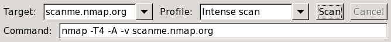
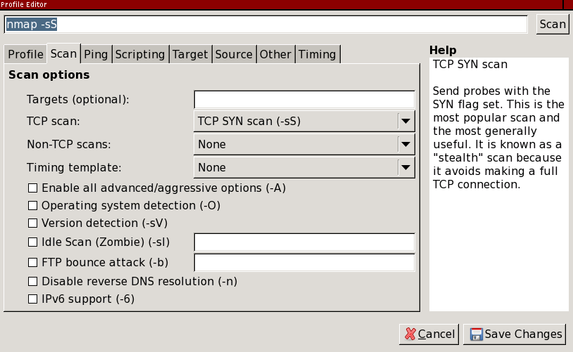
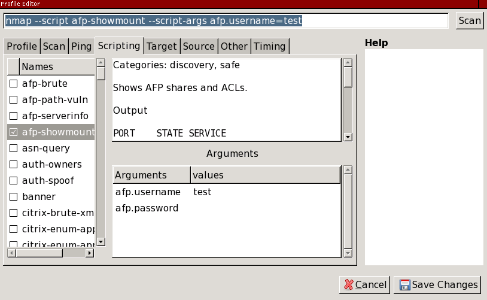

Blocked for possible web abuse

Blocked for possible web abuse
==========

The IP address you are coming from has requested an inordinately large number of pages in a short amount of time and has been temporarily blocked to conserve our resources. This often happens when people try to use web spidering programs to download large portions of the site. The block will be removed 24 hours after the latest period of high traffic. If you feel this IP ban was made in error, you can email fyodor@nmap.org.

* [Nmap Network Scanning](https://nmap.org/book/toc.html)
* [Chapter 12. Zenmap GUI Users' Guide](https://nmap.org/book/zenmap.html)
* The Profile Editor

[Prev](https://nmap.org/book/zenmap-topology.html)

[Next](https://nmap.org/book/zenmap-filter.html)

The Profile Editor
----------

 It is common with Nmap to want to run the same scan repeatedly. For example, a system administrator may run a scan of an entire network once a month to keep track of things. Zenmap's mechanism for facilitating this is called profiles.

Figure 12.9. Choosing a profile

 Each window contains a combo box labeled “Profile”. Opening it shows what profiles are available. Selecting a profile will cause the “Command” field to display the command line that will be executed. The profiles that come with Zenmap are sufficient for many scanning purposes, but sooner or later you will want to create your own.

### Editing a Command ###

 The profile editor can be used as a handy interactive Nmap command editor. Select “New Profile or Command” from under the “Profile” menu or use the **ctrl**+**P** keyboard shortcut. The profile editor will appear, displaying whatever command was shown in the main window.

Figure 12.10. The profile editor

 The text entry at the top shows the command being edited. You can type directly in this field if you know the options you want to use. The controls in the middle let you choose options by checking boxes or selecting from menus. There is a two-way relationship between the command string and the controls: when you change one of the controls it causes an immediate change in the command string, and when you edit the command string the controls update themselves to match. Hover the mouse pointer over an option to see a description of what it does and what kind of input it expects.

 To run the new command line, click the “Scan” button. This will copy the command to the main window, dismiss the profile editor, and start running the scan. To make further changes to the command, just select “New Profile or Command” again, remembering that it will use whatever command is shown on the screen.

#### Script selection ####

 The “Scripting” tab deserves special mention because of its many options. The scrolling list on the left shows all the scripts that are installed in `script.db`. Scripts can be selected or deselected individually by clicking the checkbox next to the script name. When a script is highlighted, its description and arguments are displayed. The arguments are editable. Hover the mouse pointer over an argument to see help for it. [Figure 12.11, “The “Scripting” profile editor tab”](https://nmap.org/book/zenmap-profile-editor.html#zenmap-fig-profile-editor-scripting) shows a sample script selection session.

Figure 12.11. The “Scripting” profile editor tab

 To select scripts by categories or Boolean operators, as described in [the section called “Script Selection”](https://nmap.org/book/nse-usage.html#nse-script-selection), edit the argument to the `--script` option in the command entry at the top. The scrolling list of selected scripts will update itself after a short delay.

### Creating a New Profile ###

 The procedure for creating a new profile is almost the same as for editing a command. Select “New Profile or Command” from the “Profile” menu and edit the command as you wish. Then, instead of clicking “Scan”, go to the “Profile” tab and give a name to the profile. Then click “Save Changes” to save the new profile.

 A profile may or may not include scan targets. If you often run the same scan against the same set of targets, you will find it convenient to list the targets within the profile. If you plan to run the same scan against different targets, leave the “Targets” field blank, and fill in the targets later, when you run the scan.

### Editing or Deleting a Profile ###

 To edit a profile, select the profile you want to edit, then choose “Edit Selected Profile” from the “Profile” menu or use the **ctrl**+**E** keyboard shortcut. The profile editor will open, this time with the name and description filled from the profile selected. Click “Save Changes” to save any changes or “Cancel” to leave without saving.

 When you open the profile editor using “Edit Selected Profile”, an additional “Delete” button will be present at the bottom. Zenmap will present a warning before deleting the profile.

---

[Prev](https://nmap.org/book/zenmap-topology.html)Surfing the Network Topology

[Up](https://nmap.org/book/zenmap.html)Chapter 12. Zenmap GUI Users' Guide

[Home](https://nmap.org/book/toc.html)

[Next](https://nmap.org/book/zenmap-filter.html)Host Filtering