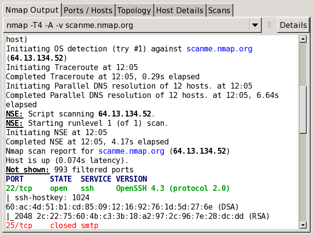
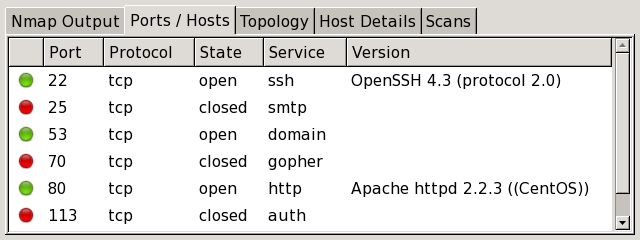
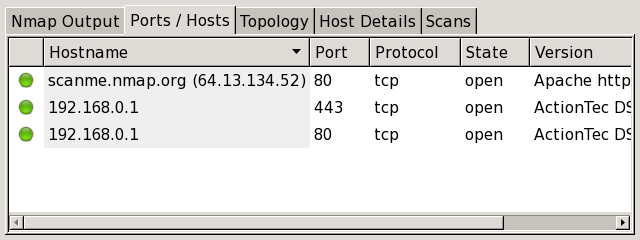
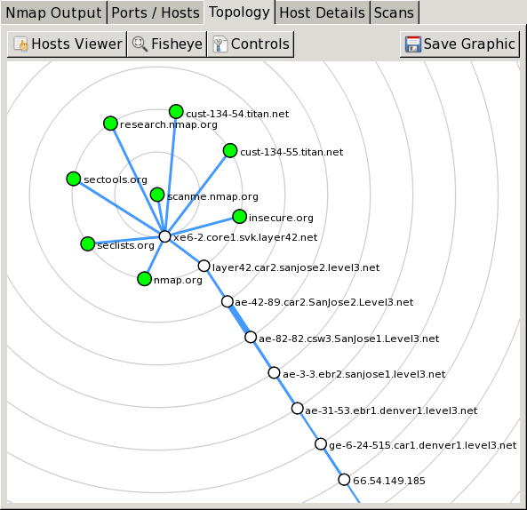
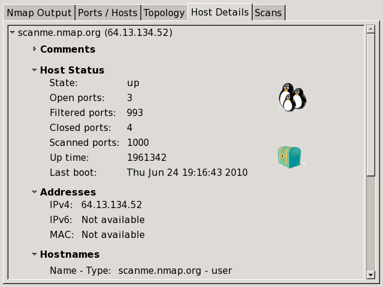
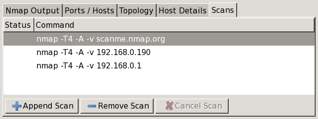
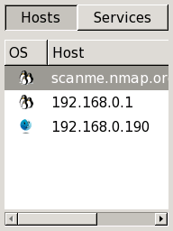
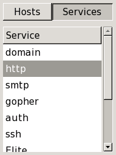

Blocked for possible web abuse

Blocked for possible web abuse
==========

The IP address you are coming from has requested an inordinately large number of pages in a short amount of time and has been temporarily blocked to conserve our resources. This often happens when people try to use web spidering programs to download large portions of the site. The block will be removed 24 hours after the latest period of high traffic. If you feel this IP ban was made in error, you can email fyodor@nmap.org.

* [Nmap Network Scanning](https://nmap.org/book/toc.html)
* [Chapter 12. Zenmap GUI Users' Guide](https://nmap.org/book/zenmap.html)
* Interpreting Scan Results

[Prev](https://nmap.org/book/zenmap-scanning.html)

[Next](https://nmap.org/book/zenmap-saving.html)

Interpreting Scan Results
----------

 Nmap's output is displayed during and after a scan. This output will be familiar to Nmap users. Except for Zenmap's color highlighting, this doesn't offer any visualization advantages over running Nmap in a terminal. However, other parts of Zenmap's interface interpret and aggregate the terminal output in a way that makes scan results easier to understand and use.

### Scan Results Tabs ###

 Each scan window contains five tabs which each display different aspects of the scan results. They are: “Nmap Output”, “Ports / Hosts”, “Topology”, “Host Details”, and “Scans”. Each of these are discussed in this section.

#### The “Nmap Output” tab ####

 The “Nmap Output” tab is displayed by default when a scan is run. It shows the familiar Nmap terminal output. The display highlights parts of the output according to their meaning; for example, open and closed ports are displayed in different colors. Custom highlights can be configured in `zenmap.conf` (see [the section called “Description of `zenmap.conf`”](https://nmap.org/book/zenmap-conf.html)).

 Recall that the results of more than one scan may be shown in a window (see [the section called “Scan Aggregation”](https://nmap.org/book/zenmap-scanning.html#aggregation)). The drop-down combo box at the top of the tab allows you to select the scan to display. The “Details” button brings up a window showing miscellaneous information about the scan, such as timestamps, command-line options, and the Nmap version number used.

#### The “Ports / Hosts” tab ####

 The “Ports / Hosts” tab's display differs depending on whether a host or a service is currently selected. When a host is selected, it shows all the interesting ports on that host, along with version information when available. Host selection is further described in [the section called “Sorting by Host”](https://nmap.org/book/zenmap-results.html#zenmap-sort-host).

 When a service is selected, the “Ports / Hosts” tab shows all the hosts which have that port open or filtered. This is a good way to quickly answer the question “What computers are running HTTP?” Service selection is further described in [the section called “Sorting by Service”](https://nmap.org/book/zenmap-results.html#zenmap-sort-service).

#### The “Topology” tab ####

 The “Topology” tab is an interactive view of the connections between hosts in a network. Hosts are arranged in concentric rings. Each ring represents an additional network hop from the center node. Clicking on a node brings it to the center. Because it shows a representation of the network paths between hosts, the “Topology” tab benefits from the use of the `--traceroute` option. Topology view is discussed in more detail in [the section called “Surfing the Network Topology”](https://nmap.org/book/zenmap-topology.html).

#### The “Host Details” tab ####

 The “Host Details” tab breaks all the information about a single host into a hierarchical display. Shown are the host's names and addresses, its state (up or down), and the number and status of scanned ports. The host's uptime, operating system, OS icon (see [Figure 12.5, “OS icons”](https://nmap.org/book/zenmap-results.html#zenmap-os-icons)), and other associated details are shown when available. When no exact OS match is found, the closest matches are displayed. There is also a collapsible text field for storing a comment about the host which will be saved when the scan is saved to a file (see [the section called “Saving and Loading Scan Results”](https://nmap.org/book/zenmap-saving.html)).

 Each host has an icon that provides a very rough “vulnerability” estimate, which is based solely on the number of open ports. The icons and the numbers of open ports they correspond to are

|     0–2 open ports,   |
|---------------------------------------------------------------------------------------------------------------------|
|     3–4 open ports,   |
|     5–6 open ports,   |
|   7–8 open ports, and |
|  9 or more open ports.|

#### The “Scans” tab ####

 The “Scans” tab shows all the scans that are aggregated to make up the network inventory. From this tab you can add scans (from a file or directory) and remove scans.

 While a scan is executing and not yet complete, its status is “Running”. You may cancel a running scan by clicking the “Cancel Scan” button.

### Sorting by Host ###

Figure 12.4. Host selection

 On the left side of Zenmap's main window is a column headed by two buttons labeled “Hosts” and “Services”. Clicking the “Hosts” button will bring up a list of all hosts that were scanned, as in [Figure 12.4](https://nmap.org/book/zenmap-results.html#zenmap-fig-host-selection). Commonly this contains just a single host, but it can contain thousands in a large scan. The host list can be sorted by OS or host name/IP address by clicking the headers at the top of the list. Selecting a host will cause the “Ports / Hosts” tab to display the interesting ports on that host.

 Each host is labeled with its host name or IP address and has an icon indicating the operating system that was detected for that host. The icon is meaningful only if OS detection (`-O`) was performed. Otherwise, the icon will be a default one indicating that the OS is unknown. [Figure 12.5](https://nmap.org/book/zenmap-results.html#zenmap-os-icons) shows all possible icons. Note that Nmap's OS detection cannot always provide the level of specificity implied by the icons; for example a Red Hat Linux host will often be displayed with the generic Linux icon.

Figure 12.5. OS icons

|          FreeBSD         |              Irix             |      Linux     |
|------------------------------------------------------------------------------------------------------------------------|--------------------------------------------------------------------------------------------------------------------------|------------------------------------------------------------------------------------------------------------|
|           Mac OS          |           OpenBSD          |  Red Hat Linux|
|   Solaris or OpenSolaris |         Ubuntu Linux        |      Windows     |
|  Other (no specific icon)|  OS detection not performed|                                                                                                            |

### Sorting by Service ###

Figure 12.6. Service selection

 Above the same list that contains all the scanned hosts is a button labeled “Services”. Clicking that will change the list into a list of all ports that are `open`, `filtered`, or `open|filtered` on any of the targets, as shown in [Figure 12.6](https://nmap.org/book/zenmap-results.html#zenmap-fig-service-selection). (Ports that were not listed explicitly in Nmap output are not included.) The ports are identified by service name (`http`, `ftp`, etc.). The list can be sorted by clicking the header of the list.

 Selecting a host will cause the “Ports / Hosts” tab to display all the hosts that have that service open or filtered.

---

[Prev](https://nmap.org/book/zenmap-scanning.html)Scanning

[Up](https://nmap.org/book/zenmap.html)Chapter 12. Zenmap GUI Users' Guide

[Home](https://nmap.org/book/toc.html)

[Next](https://nmap.org/book/zenmap-saving.html)Saving and Loading Scan Results