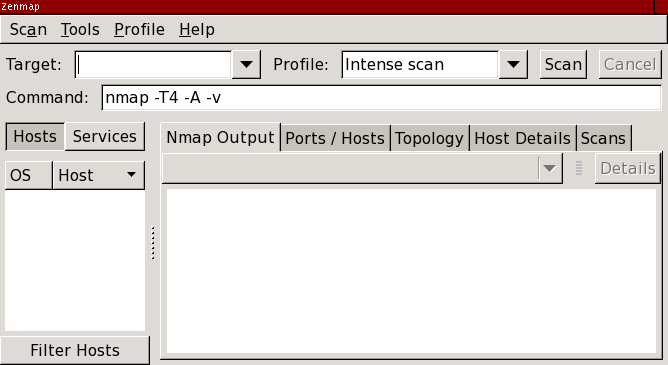
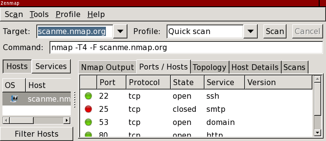
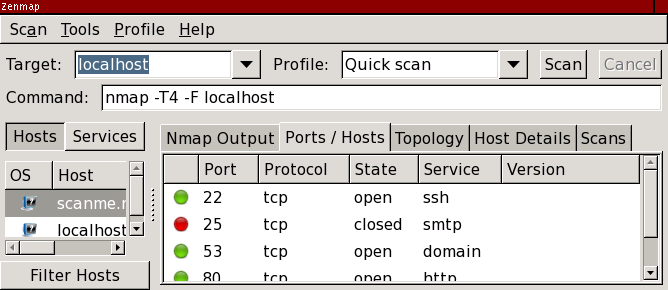
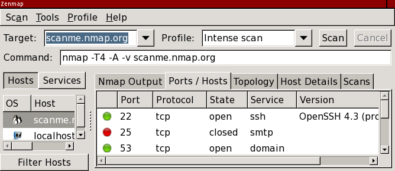

Blocked for possible web abuse

Blocked for possible web abuse
==========

The IP address you are coming from has requested an inordinately large number of pages in a short amount of time and has been temporarily blocked to conserve our resources. This often happens when people try to use web spidering programs to download large portions of the site. The block will be removed 24 hours after the latest period of high traffic. If you feel this IP ban was made in error, you can email fyodor@nmap.org.

* [Nmap Network Scanning](https://nmap.org/book/toc.html)
* [Chapter 12. Zenmap GUI Users' Guide](https://nmap.org/book/zenmap.html)
* Scanning

[Prev](https://nmap.org/book/zenmap.html)

[Next](https://nmap.org/book/zenmap-results.html)

Scanning
----------

 Begin Zenmap by typing **zenmap** in a terminal or by clicking the Zenmap icon in the desktop environment. The main window, as shown in [Figure 12.2](https://nmap.org/book/zenmap-scanning.html#zenmap-fig-main), is displayed.

Figure 12.2. Zenmap's main window

 One of Zenmap's goals is to make security scanning easy for beginners and for experts. Running a scan is as simple as typing the target in the “Target” field, selecting the “Intense scan” profile, and clicking the “Scan” button. This is shown in [Figure 12.3](https://nmap.org/book/zenmap-scanning.html#zenmap-fig-target).

Figure 12.3. Target and profile selection

 While a scan is running (and after it completes), the output of the Nmap command is shown on the screen.

 Any number of targets, separated by spaces, may be entered in the target field. All the target specifications supported by Nmap are also supported by Zenmap, so targets such as `192.168.0.0/24` and `10.0.0-5.*` work. Zenmap remembers the targets scanned most recently. To re-scan a host, select the host from the combo box attached to the “Target” text field.

### Profiles ###

 The “Intense scan” is just one of several scan profiles that come with Zenmap. Choose a profile by selecting it from the “Profile” combo box. Profiles exist for several common scans. After selecting a profile the Nmap command line associated with it is displayed on the screen. Of course, it is possible to edit these profiles or create new ones. This is covered in [the section called “The Profile Editor”](https://nmap.org/book/zenmap-profile-editor.html).

 It is also possible to type in an Nmap command and have it executed without using a profile. Just type in the command and press return or click “Scan”. When you do this the “Profile” entry becomes blank to indicate that the scan is not using any profile—it comes directly from the command field.

### Scan Aggregation ###

 Zenmap has the ability to combine the results of many Nmap scans into one view, a feature known as *scan aggregation*. When one scan is finished, you may start another in the same window. When the second scan is finished, its results are merged with those from the first. The collection of scans that make up an aggregated view is called a *network inventory*.

 An example of aggregation will make the concept clearer. Let's run a quick scan against scanme.nmap.org.

 Now do the same against localhost:

 Now results for both scanme and localhost are shown. This is something you could have done with one Nmap scan, giving both targets, although it's convenient not to have to think of all the targets in advance. Now suppose we want some more information about scanme, so we launch an intense scan on it.

 Now scanme has a little penguin icon showing that its operating system has been detected as Linux. Additionally one of its services has been identified. Now we're doing something you can't do with a single Nmap scan, because you can't single out a host for more intense scanning like we did. The results for localhost are still present, though we won't know more about it than we did before unless we decide to do a more in-depth scan.

 It is not necessary to wait for one scan to finish before starting another. Several scans may run concurrently. As each one finishes its results are added to the inventory. Any number of scans may make up an inventory; the collection of scans is managed in the “Scans” scan results tab, as fully described in [the section called “The “Scans” tab”](https://nmap.org/book/zenmap-results.html#zenmap-tab-scans).

 It is possible to have more than one inventory open at the same time. Zenmap uses the convention that one window represents one network inventory. To start a new inventory, select “New Window” from the “Scan” menu or use the **ctrl**+**N** keyboard shortcut. Starting a scan with the “Scan” button will append the scan to the inventory in the current window. To put it in a different inventory open up a separate window and run the scan from there. Loading scan results from a file or directory will start a new inventory, unless you use the “Open Scan in This Window” menu item. For more on saving and loading network inventories and individual scans see [the section called “Saving and Loading Scan Results”](https://nmap.org/book/zenmap-saving.html).

 To close a window choose “Close Window” from the “Scan” menu or press **ctrl**+**W**. When all open windows are closed the application will terminate. To close all open windows select “Quit” or press **ctrl**+**Q**.

---

[Prev](https://nmap.org/book/zenmap.html)Chapter 12. Zenmap GUI Users' Guide

[Up](https://nmap.org/book/zenmap.html)Chapter 12. Zenmap GUI Users' Guide

[Home](https://nmap.org/book/toc.html)

[Next](https://nmap.org/book/zenmap-results.html)Interpreting Scan Results