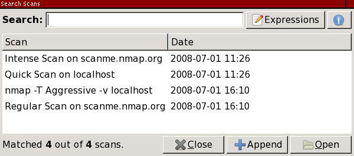
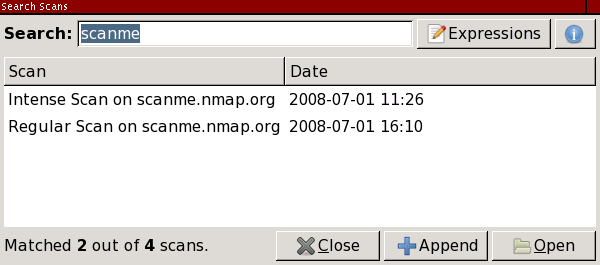
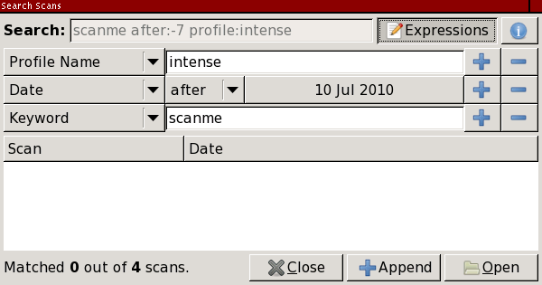

Blocked for possible web abuse

Blocked for possible web abuse
==========

The IP address you are coming from has requested an inordinately large number of pages in a short amount of time and has been temporarily blocked to conserve our resources. This often happens when people try to use web spidering programs to download large portions of the site. The block will be removed 24 hours after the latest period of high traffic. If you feel this IP ban was made in error, you can email fyodor@nmap.org.

* [Nmap Network Scanning](https://nmap.org/book/toc.html)
* [Chapter 12. Zenmap GUI Users' Guide](https://nmap.org/book/zenmap.html)
* Searching Saved Results

[Prev](https://nmap.org/book/zenmap-filter.html)

[Next](https://nmap.org/book/zenmap-compare.html)

Searching Saved Results
----------

 Zenmap allows you to search saved scan results files and the database of recent scans. To begin searching, select “Search Scan Results” from the “Tools” menu or use the **ctrl**+**F** keyboard shortcut. The search dialog appears as shown in [Figure 12.13](https://nmap.org/book/zenmap-search.html#zenmap-fig-search).

Figure 12.13. The search dialog

 The search interface initially shows all the scans in the recent scans database (for which see [the section called “The Recent Scans Database”](https://nmap.org/book/zenmap-saving.html#zenmap-db)). The reason all the scans are shown is simple—no restrictions have yet been placed on the search, so every possible result is returned.

 Searches may be given in terms of several search criteria, however the simplest search is just a keyword search. Just type a word like `scanme` in the “Search” field to find all scans that have that word as part of their output, whether as a host name, operating system name, profile, or anything else. An example of this is shown in [Figure 12.14](https://nmap.org/book/zenmap-search.html#zenmap-fig-search-keyword).

Figure 12.14. Keyword search

 Searches happen live, as you type. When you have found the scan you want click the “Open” button or double-click on the scan name.

 More complicated searches can be built up using the “Expressions” interface. Click the “Expressions” button and graphical representation of the current search will appear. Modify the search by selecting from the combo boxes displayed. Click “+” to add a criterion and “−” to remove one. Click the “Expressions” button again to hide the criteria (they are still present in the search string). Editing of the search text is disabled while the expressions are shown. An example of a more complicated search is shown in [Figure 12.15](https://nmap.org/book/zenmap-search.html#zenmap-fig-search-expressions).

Figure 12.15. Expressions search

 Searches are and-based, meaning that all the criteria must be true for a scan to match and appear in the results list. Most searches are case-insensitive. (The only case-sensitive criterion is `option:`.) By default only the scans in the recent scans database are searched. To recursively search files in a directory, use the “Include Directory” expression.

 You will have noticed that whenever you choose a search expression a text representation of it appears in the search entry. The string in the “Search” field is what really controls the search; the “Expressions” interface is just a convenient way to set it. When you have learned what search strings correspond to what expressions, you may skip the expressions interface and just type in a search string directly.

 The following is a list of all the textual search criteria recognized by the search interface. Most criteria have a short form: `d:-5` is the same as `date:-5` and `op:80` is the same as `open:80`. The short form of each criterion is given in the list below.

[ `*`<keyword>`*` ]()

[ An unadorned word matches anything in a scan. For example, `apache` will match all Apache servers and `linux` will match all Linux hosts. There is a chance of false positives when using the keyword search, like if a host happens to be named `apache` or `linux`. ]()

[ Port states ]()

[ Every possible port state is also a search criterion. They are ]()

|      `open:*`<ports>`*` (`op:` for short)      |
|------------------------------------------------|
|     `closed:*`<ports>`*` (`cp:` for short)     |
|    `filtered:*`<ports>`*` (`fp:` for short)    |
|  `unfiltered:*`<ports>`*` (`ufp:` for short)   |
| `open|filtered:*`<ports>`*` (`ofp:` for short) |
|`closed|filtered:*`<ports>`*` (`cfp:` for short)|

[ Use `open:80` to match scans that have a host with port 80 open. The *`<ports>`* argument may also be a comma-separated list. ]()

[ Additionally the `scanned:*`<ports>`*` (`sp:` for short) criterion matches scans in which the given ports were scanned, whatever their final state. ]()

[ `date:*`<YYYY-MM-DD>`*` or `date:-*`<n>`*` (`d:` for short) ]()

[ Matches scans that occurred on the given date in *`<YYYY-MM-DD>`* format. Or use `date:-*`<n>`*` to match scans that occurred any on the day *`<n>`* days ago. Use `date:-1` to find scans performed yesterday. ]()

[

 When using the *`<YYYY-MM-DD>`* format, the date may be followed by one or more `~`, each of which widens the range of dates matched by one day on both sides. `date:2007-12-23` matches scans that occurred between 00:00 and 24:00 on December 23, 2007. `date:2007-12-23~` matches scans that took place between 00:00 on December 22 and 24:00 on December 24. This “fuzzy” date matching is useful when you can't remember exactly when you ran a scan.

]()[ `after:*`<YYYY-MM-DD>`*` or `after:-*`<n>`*` (`a:` for short) ]()

[ Matches scans that occurred on or after the given date in *`<YYYY-MM-DD>`* format. Or use `after:-*`<n>`*` to match scans that occurred within the last *`<n>`* days. For example, `after:-7` matches scans that happened in the last week. ]()

[ `before:*`<YYYY-MM-DD>`*` or `before:-*`<n>`*` (`b:` for short) ]()

[ Matches scans that occurred on or before the given date in *`<YYYY-MM-DD>`* format. Or use `before:-*`<n>`*` to match scans that occurred any time before *`<n>`* days ago. ]()

[ `target:*`<name>`*` (`t:` for short) ]()

[ Matches scans of any hosts with the given name. The name may be either the name specified in the scan or the reverse-DNS]()[ name of any host. ]()

[ `option:*`<option>`*` (`o:` for short) ]()

[ Matches scans that used the given command-line option. Omit any leading `-` or `--`: `option:A` matches scans that used the `-A` option. ]()

[ This criterion matches only literally. `option:O` will not match scans that used `-A`, even though `-A` implies `-O`. Similarly `option:sU` will not match scans that used `-sSU`. Option matching is case-sensitive. ]()

[ `os:*`<string>`*` ]()

[ Matches scans of hosts with the given string in any part of their OS description. `os:windows` will return scans of Microsoft Windows hosts broadly. ]()

[ `service:*`<string>`*` (`s:` for short) ]()

[ Matches scans of hosts with the given string in any part of the service description of any of their ports. `service:ssh` will return scans of hosts running any type of SSH. ]()

[ `profile:*`<name>`*` (`pr:` for short) ]()

[ Matches scans that used the named profile, for example `profile:"intense scan"`. ]()

[ `inroute:*`<host>`*` (`ir:` for short) ]()

[ Matches scans where the given host appears as an intermediate router in `--traceroute`]()[ output. ]()

[ `dir:*`<directory>`*` ]()

[`dir:` is not really a search criterion. Rather it is the way to search a directory in the filesystem in addition to those in the recent scans database. Directories are searched recursively for files ending with certain extensions, `xml` only by default. To match more file names modify the `file_extension` variable of the `[search]` section of `zenmap.conf` according to the instructions in ]()[the section called “Sections of `zenmap.conf`”](https://nmap.org/book/zenmap-conf.html#zenmap-conf-sections).

---

[Prev](https://nmap.org/book/zenmap-filter.html)Host Filtering

[Up](https://nmap.org/book/zenmap.html)Chapter 12. Zenmap GUI Users' Guide

[Home](https://nmap.org/book/toc.html)

[Next](https://nmap.org/book/zenmap-compare.html)Comparing Results