Blocked for possible web abuse

Blocked for possible web abuse
==========

The IP address you are coming from has requested an inordinately large number of pages in a short amount of time and has been temporarily blocked to conserve our resources. This often happens when people try to use web spidering programs to download large portions of the site. The block will be removed 24 hours after the latest period of high traffic. If you feel this IP ban was made in error, you can email fyodor@nmap.org.

* [Nmap Network Scanning](https://nmap.org/book/toc.html)
* [Chapter 12. Zenmap GUI Users' Guide](https://nmap.org/book/zenmap.html)
* Surfing the Network Topology

[Prev](https://nmap.org/book/zenmap-saving.html)

[Next](https://nmap.org/book/zenmap-profile-editor.html)

Surfing the Network Topology
----------

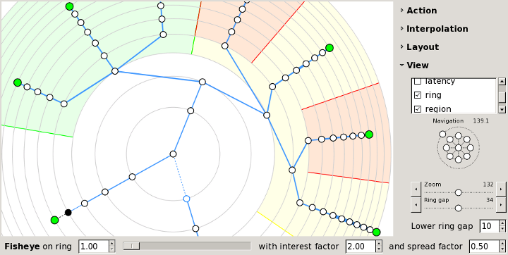

### An Overview of the “Topology” Tab ###

 Zenmap's “Topology” tab provides an interactive, animated visualization of the connections between hosts on a network. Hosts are shown as nodes on a graph that extends radially from the center. Click and drag to pan the display, and use the controls provided to zoom in and out. Click on a host and it becomes the new center. The graph rearranges itself in a smooth animation to reflect the new view of the network. Run a new scan and every new host and network path will be added to the topology automatically.

 The topology view is most useful when combined with Nmap's `--traceroute` option, because that's the option that discovers the network path to a host. You can view a network inventory that doesn't have traceroute information in the topology, but network paths will not be visible. Remember, though, that you can add traceroute information to a network inventory just by running another scan thanks to Zenmap's scan aggregation.

 Initially the topology is shown from the point of view of localhost, with you at the center. Click on a host to move it to the center and see what the network looks like from its point of view.

 The topology view is an adaptation of the RadialNet program by João Paulo S. Medeiros.

### Legend ###

|                                                                                                                                                        The topology view uses many symbols and color conventions. This section explains what they mean.                                                                                                                                                        |                                                                                                                                                                                                                                                                                                                                                                                                                                                                                                                                                                         |
|----------------------------------------------------------------------------------------------------------------------------------------------------------------------------------------------------------------------------------------------------------------------------------------------------------------------------------------------------------------------------------------------------------------|-------------------------------------------------------------------------------------------------------------------------------------------------------------------------------------------------------------------------------------------------------------------------------------------------------------------------------------------------------------------------------------------------------------------------------------------------------------------------------------------------------------------------------------------------------------------------|
||      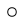     | |--------------------------------------------------------------------------| |  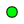 | |  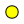 | | 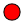||                                                                Each regular host in the network is represented by a little circle. The color and size of the circle is determined by the number of open ports on the host. The more open ports, the larger the circle. A white circle represents an intermediate host in a network path that was not port scanned. If a host has fewer than three open ports, it will be green; between three and six open ports, yellow; more than six open ports, red.                                                                |
|                                                                                                                                                                                                                                                                                                                                                 |                                                                                                                                                                                                                                                                                                                                                                                                                                                                                                                                                                         |
|                                                                                                                                                                                                                                                                                                                                         |                                                                                                                                                                                                                                                                                                                                                                                                                                                                                                                                                                         |
|                                                                                                                                                                                                                                                                                                                                         |                                                                                                                                                                                                                                                                                                                                                                                                                                                                                                                                                                         |
|                                                                                                                                                                                                                                                                                                                                       |                                                                                                                                                                                                                                                                                                                                                                                                                                                                                                                                                                         |
|            |  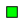 | |----------------------------------------------------------------------------------------| |  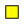 | | 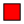|             |                                                                                                                                                                                                                                 If a host is a router, switch, or wireless access point, it is drawn with a square rather than a circle.                                                                                                                                                                                                                                |
|                                                                                                                                                                                                                                                                                                                           |                                                                                                                                                                                                                                                                                                                                                                                                                                                                                                                                                                         |
|                                                                                                                                                                                                                                                                                                                           |                                                                                                                                                                                                                                                                                                                                                                                                                                                                                                                                                                         |
|                                                                                                                                                                                                                                                                                                                         |                                                                                                                                                                                                                                                                                                                                                                                                                                                                                                                                                                         |
|                                                                                                                                                                                                                                                                                                                                                 |                                                                                                                                                                                                                      Network distance is shown as concentric gray rings. Each additional ring signifies one more network hop from the center host.                                                                                                                                                                                                                      |
|                                                                                           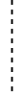                                                                                          | Connections between hosts are shown with colored lines. Primary traceroute connections are shown with blue lines. Alternate paths (paths between two hosts where a different path already exists) are drawn in orange. Which path is primary and which paths are alternates is arbitrary and controlled by the order in which paths were recorded. The thickness of a line is proportional to its round-trip time; hosts with a higher RTT have a thicker line. Hosts with no traceroute information are clustered around localhost, connected with a dashed black line.|
|                                                                                                                                                                 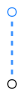                                                                                                                                                                |                                                                                                                                                                                         If there is no RTT for a hop (a missing traceroute entry), the connection is shown with a blue dashed line and the unknown host that makes the connection is shown with a blue outline.                                                                                                                                                                                         |

| Some special-purpose hosts may carry one or more icons describing what type of host they are:|                                |
|----------------------------------------------------------------------------------------------|--------------------------------|
|                           |           A router.            |
|                           |           A switch.            |
|                       |    A wireless access point.    |
|                       |          A firewall.           |
|                         |A host with some ports filtered.|

### Controls ###

 The controls appear in a column when the “Controls” button is clicked. The controls are divided into sections.

#### Action controls ####

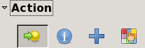

 The controls in the “Action” section control what happens when you click on a host. The buttons in this section are, from left to right, “Change focus”, “Show information”, “Group children”, and “Fill region”. When the mode is “Change focus”, clicking on a host rearranges the display to put the selected host at the center. When the mode is “Show information”, clicking on a host brings up a window with information about it.

 When the mode is “Group children”, clicking a host collapses into it all of its children—those nodes that are farther from the center. When a host is grouped it appears thus: . Clicking on a grouped node ungroups it again. This diagram shows the process of grouping.

Figure 12.7. Grouping a host's children

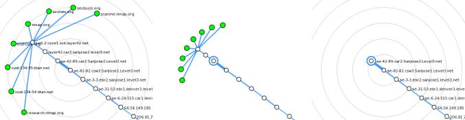

 When the mode is “Fill region”, clicking a host highlights the region of the display occupied by the host and its children. The highlighted hosts are exactly the same as those that would be grouped in “Group children” mode. You can choose different colors to highlight different regions. This diagram shows an example of several regions highlighted in different colors.

Figure 12.8. Highlighting regions of the topology

#### Interpolation controls ####

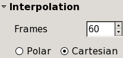

 The controls in the “Interpolation” section control how quickly the animation proceeds when part of the graph changes.

#### Layout controls ####

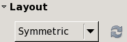

 There are two options for the automatic layout of nodes. Symmetric mode gives each subtree of a host an equal-sized slice of the graph. It shows the network hierarchy well but hosts far from the center can be squeezed close together. Weighted mode gives hosts with more children a larger piece of the graph.

#### View controls ####

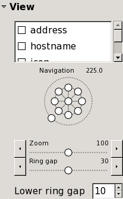

 The checkboxes in the “View” section enable and disable parts of the display. For example, disable “hostname” to show only an IP address for each host, or disable “address” to use no labels at all. The “latency” option enables and disables the display of the round-trip times to each host, as determined by Nmap's `--traceroute` option. If “slow in/out” is checked, the animation will not be linear, but will go faster in the middle of the animation and slower at the beginning and end.

 The compass-like widget pans the screen in eight directions. Click the center to return to the center host. The ring around the outside controls the rotation of the entire graph.

“Zoom” and “Ring gap” both control the overall size of the graph. “Zoom” changes the size of everything—hosts, labels, connecting lines. “Ring gap” just increases the spacing between the concentric rings, keeping everything else the same size. “Lower ring gap” gives a minimum spacing for the rings, useful mainly when fisheye is enabled.

#### Fisheye controls ####

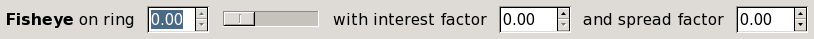

 The fisheye controls give more space to a selected ring, compressing all the others. The slider controls which ring gets the most attention. The “interest factor” is how many times greater the ring spacing is for the chosen ring than it would be with no fisheye. The “spread factor” ranges from −1 to 1. It controls how many adjacent rings are expanded around the selected ring, with higher numbers meaning more spread.

### Keyboard Shortcuts ###

 The topology display recognizes these keyboard shortcuts:

| Key |               Function               |
|-----|--------------------------------------|
|**c**|Return the display to the center host.|
|**a**|     Show or hide host addresses.     |
|**h**|       Show or hide hostnames.        |
|**i**|       Show or hide host icons.       |
|**l**|        Show or hide latency.         |
|**r**|       Show or hide the rings.        |

### The Hosts Viewer ###

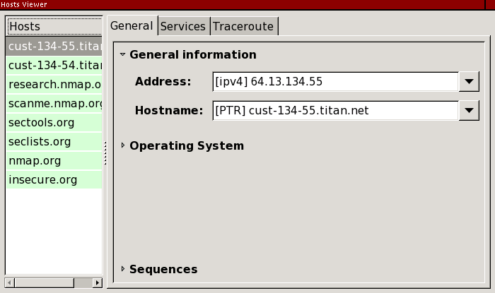

 The host viewer is an alternative way to get details about hosts. Activate the viewer by clicking the “Hosts Viewer” button. All the hosts in the inventory are presented in a list. Select any host to get details about it.

---

[Prev](https://nmap.org/book/zenmap-saving.html)Saving and Loading Scan Results

[Up](https://nmap.org/book/zenmap.html)Chapter 12. Zenmap GUI Users' Guide

[Home](https://nmap.org/book/toc.html)

[Next](https://nmap.org/book/zenmap-profile-editor.html)The Profile Editor