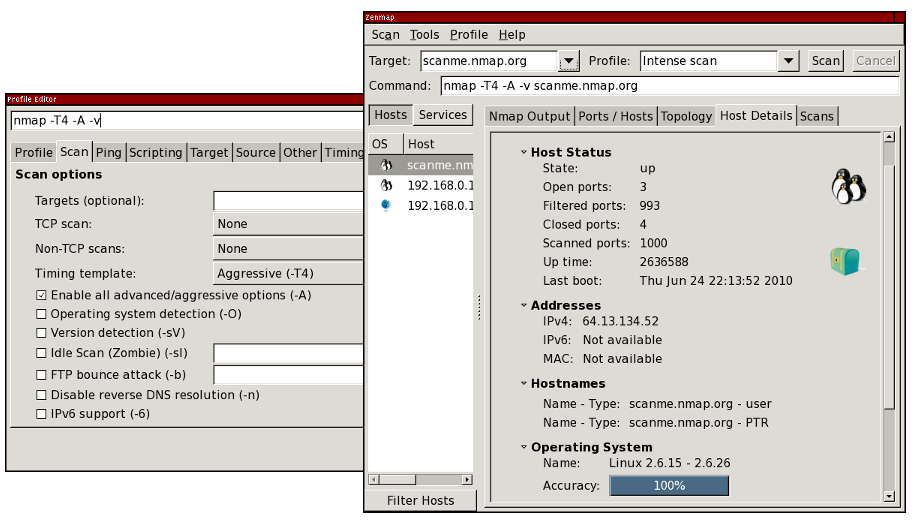

Blocked for possible web abuse

Blocked for possible web abuse
==========

The IP address you are coming from has requested an inordinately large number of pages in a short amount of time and has been temporarily blocked to conserve our resources. This often happens when people try to use web spidering programs to download large portions of the site. The block will be removed 24 hours after the latest period of high traffic. If you feel this IP ban was made in error, you can email fyodor@nmap.org.

* [Nmap Network Scanning](https://nmap.org/book/toc.html)
* Chapter 12. Zenmap GUI Users' Guide

[Prev](https://nmap.org/book/nmap-defenses-trickery.html)

[Next](https://nmap.org/book/zenmap-scanning.html)

Chapter 12. Zenmap GUI Users' Guide
==========

Table of Contents

* [Introduction](https://nmap.org/book/zenmap.html#zenmap-intro)
  * [The Purpose of a Graphical Frontend for Nmap](https://nmap.org/book/zenmap.html#zenmap-purpose)

* [Scanning](https://nmap.org/book/zenmap-scanning.html)
  * [Profiles](https://nmap.org/book/zenmap-scanning.html#zenmap-profiles)
  * [Scan Aggregation](https://nmap.org/book/zenmap-scanning.html#aggregation)

* [Interpreting Scan Results](https://nmap.org/book/zenmap-results.html)
  * [Scan Results Tabs](https://nmap.org/book/zenmap-results.html#zenmap-results-tabs)
    * [The “Nmap Output” tab](https://nmap.org/book/zenmap-results.html#zenmap-tab-nmap-output)
    * [The “Ports / Hosts” tab](https://nmap.org/book/zenmap-results.html#zenmap-tab-ports-hosts)
    * [The “Topology” tab](https://nmap.org/book/zenmap-results.html#zenmap-tab-topology)
    * [The “Host Details” tab](https://nmap.org/book/zenmap-results.html#zenmap-tab-host-details)
    * [The “Scans” tab](https://nmap.org/book/zenmap-results.html#zenmap-tab-scans)

  * [Sorting by Host](https://nmap.org/book/zenmap-results.html#zenmap-sort-host)
  * [Sorting by Service](https://nmap.org/book/zenmap-results.html#zenmap-sort-service)

* [Saving and Loading Scan Results](https://nmap.org/book/zenmap-saving.html)
  * [The Recent Scans Database](https://nmap.org/book/zenmap-saving.html#zenmap-db)

* [Surfing the Network Topology](https://nmap.org/book/zenmap-topology.html)
  * [An Overview of the “Topology” Tab](https://nmap.org/book/zenmap-topology.html#zenmap-topology-overview)
  * [Legend](https://nmap.org/book/zenmap-topology.html#zenmap-topology-legend)
  * [Controls](https://nmap.org/book/zenmap-topology.html#zenmap-topology-controls)
    * [Action controls](https://nmap.org/book/zenmap-topology.html#zenmap-topology-controls-action)
    * [Interpolation controls](https://nmap.org/book/zenmap-topology.html#zenmap-topology-controls-interpolation)
    * [Layout controls](https://nmap.org/book/zenmap-topology.html#zenmap-topology-controls-layout)
    * [View controls](https://nmap.org/book/zenmap-topology.html#zenmap-topology-controls-view)
    * [Fisheye controls](https://nmap.org/book/zenmap-topology.html#zenmap-topology-controls-fisheye)

  * [Keyboard Shortcuts](https://nmap.org/book/zenmap-topology.html#zenmap-topology-shortcuts)
  * [The Hosts Viewer](https://nmap.org/book/zenmap-topology.html#zenmap-topology-hosts-viewer)

* [The Profile Editor](https://nmap.org/book/zenmap-profile-editor.html)
  * [Editing a Command](https://nmap.org/book/zenmap-profile-editor.html#zenmap-edit-command)
    * [Script selection](https://nmap.org/book/zenmap-profile-editor.html#zenmap-profile-editor-scripting)

  * [Creating a New Profile](https://nmap.org/book/zenmap-profile-editor.html#zenmap-new-profile)
  * [Editing or Deleting a Profile](https://nmap.org/book/zenmap-profile-editor.html#zenmap-profile-editing)

* [Host Filtering](https://nmap.org/book/zenmap-filter.html)
* [Searching Saved Results](https://nmap.org/book/zenmap-search.html)
* [Comparing Results](https://nmap.org/book/zenmap-compare.html)
* [Zenmap in Your Language](https://nmap.org/book/zenmap-lang.html)
  * [Creating a new translation](https://nmap.org/book/zenmap-lang.html#zenmap-lang-new)

* [Files Used by Zenmap](https://nmap.org/book/zenmap-files.html)
  * [The `nmap` Executable](https://nmap.org/book/zenmap-files.html#zenmap-executable)
  * [System Configuration Files](https://nmap.org/book/zenmap-files.html#zenmap-system-conf)
  * [Per-user Configuration Files](https://nmap.org/book/zenmap-files.html#zenmap-user-conf)
  * [Output Files](https://nmap.org/book/zenmap-files.html#zenmap-output-files)

* [Description of `zenmap.conf`](https://nmap.org/book/zenmap-conf.html)
  * [Sections of `zenmap.conf`](https://nmap.org/book/zenmap-conf.html#zenmap-conf-sections)

* [Command-line Options](https://nmap.org/book/zenmap-command-line.html)
  * [Synopsis](https://nmap.org/book/zenmap-command-line.html#zenmap-cmd-synopsis)
  * [Options Summary](https://nmap.org/book/zenmap-command-line.html#zenmap-cmd-summary)
  * [Error Output](https://nmap.org/book/zenmap-command-line.html#zenmap-cmd-errors)

* [History](https://nmap.org/book/zenmap-history.html)

Introduction
----------

 Zenmap is the official graphical user interface (GUI) for the Nmap Security Scanner. It is a multi-platform, free and open-source application designed to make Nmap easy for beginners to use while providing advanced features for experienced Nmap users. Frequently used scans can be saved as profiles to make them easy to run repeatedly. A command creator allows interactive creation of Nmap command lines. Scan results can be saved and viewed later. Saved scans can be compared with one another to see how they differ. The results of recent scans are stored in a searchable database. A typical Zenmap screen shot is shown in [Figure 12.1](https://nmap.org/book/zenmap.html#zenmap-fig-typical). See the [official Zenmap web page](https://nmap.org/zenmap/) for more screen shots.

Figure 12.1. Typical Zenmap screen shot

 This guide is meant to make Nmap and Zenmap easy to use together, even if you haven't used either before. For the parts of this guide that deal specifically with Nmap (command-line options and such), refer to [Chapter 15, *Nmap Reference Guide*](https://nmap.org/book/man.html).

### The Purpose of a Graphical Frontend for Nmap ###

 No frontend can replace good old command-line Nmap. The nature of a frontend is that it depends on another tool to do its job. Therefore the purpose of Zenmap is not to replace Nmap, but to make Nmap *more useful*. Here are some of the advantages Zenmap offers over plain Nmap.

Interactive and graphical results viewing

 In addition to showing Nmap's normal output, Zenmap can arrange its display to show all ports on a host or all hosts running a particular service. It summarizes details about a single host or a complete scan in a convenient display. Zenmap can even draw a topology map of discovered networks. The results of several scans may be combined together and viewed at once.

Comparison

 Zenmap has the ability to show the differences between two scans. You can see what changed between the same scan run on different days, between scans of two different hosts, between scans of the same hosts with different options, or any other combination. This allows administrators to easily track new hosts or services appearing on their networks, or existing ones going down.

Convenience

 Zenmap keeps track of your scan results until you choose to throw them away. That means you can run a scan, see the results, and then decide whether to save them to a file. There is no need to think of a file name in advance.

Repeatability

 Zenmap's command profiles make it easy to run the exact same scan more than once. There's no need to set up a shell script to do a common scan.

Discoverability

 Nmap has literally hundreds of options, which can be daunting for beginners. Zenmap's interface is designed to always show the command that will be run, whether it comes from a profile or was built up by choosing options from a menu. This helps beginners learn and understand what they are doing. It also helps experts double-check exactly what will be run before they press “Scan”.

---

[Prev](https://nmap.org/book/nmap-defenses-trickery.html)Clever Trickery

[Up](https://nmap.org/book/toc.html)Nmap Network Scanning

[Home](https://nmap.org/book/toc.html)

[Next](https://nmap.org/book/zenmap-scanning.html)Scanning